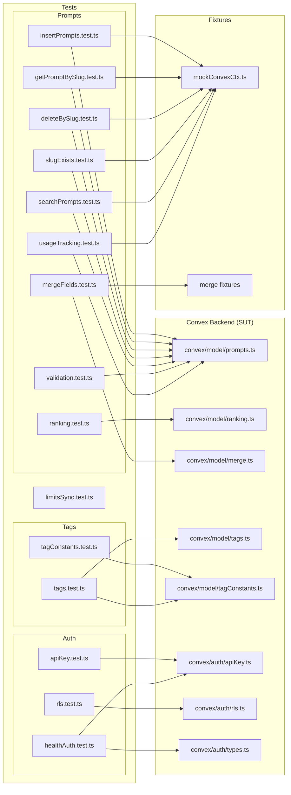
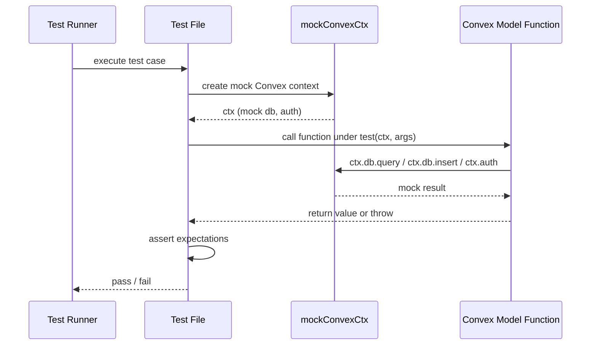

# Convex Unit Tests

## Overview

Unit test suite covering the Convex backend logic for LiminalDB. Tests are organized into four domains—**prompts**, **tags**, **auth**, and **health**—and exercise model-layer functions against mock Convex contexts and fixtures. The suite validates CRUD operations, slug handling, search, ranking, validation, merge logic, row-level security, API-key authentication, usage tracking, and rate-limit synchronization.

## Responsibilities

- Verify prompt CRUD operations (insert, get-by-slug, delete-by-slug, slug-exists)
- Validate prompt input constraints and error handling
- Test prompt search and ranking logic
- Test field merge behavior for prompt updates
- Confirm usage tracking increments and limits
- Validate tag CRUD and tag-constant integrity
- Test API key authentication and health-auth flows
- Verify row-level security (RLS) policy enforcement
- Test rate-limit / plan-limit synchronization

## Structure Diagram

## Entity Table

| Name | Kind | Role | Public Entrypoints | Depends On | Used By |
| --- | --- | --- | --- | --- | --- |
| insertPrompts.test.ts | file | Tests prompt insertion including upsert, duplicate handling, tag attachment, and error cases | none | convex/model/prompts.ts, tests/fixtures/mockConvexCtx.ts, convex/_generated/dataModel.d.ts | none |
| getPromptBySlug.test.ts | file | Tests retrieval of prompts by slug with various edge cases | none | convex/model/prompts.ts, tests/fixtures/mockConvexCtx.ts | none |
| deleteBySlug.test.ts | file | Tests prompt deletion by slug including not-found and ownership checks | none | convex/model/prompts.ts, tests/fixtures/mockConvexCtx.ts | none |
| slugExists.test.ts | file | Tests slug existence checks | none | convex/model/prompts.ts, tests/fixtures/mockConvexCtx.ts | none |
| searchPrompts.test.ts | file | Tests prompt search/filter functionality | none | convex/model/prompts.ts, tests/fixtures/mockConvexCtx.ts | none |
| ranking.test.ts | file | Tests prompt ranking/scoring algorithm | none | convex/model/ranking.ts | none |
| mergeFields.test.ts | file | Tests field-level merge logic for prompt updates | none | convex/model/merge.ts, tests/fixtures/merge.ts | none |
| validation.test.ts | file | Tests prompt input validation rules | none | convex/model/prompts.ts | none |
| usageTracking.test.ts | file | Tests usage counter increments and limit enforcement | none | convex/model/prompts.ts, tests/fixtures/mockConvexCtx.ts | none |
| tagConstants.test.ts | file | Tests tag constant definitions and constraints | none | convex/model/tagConstants.ts | none |
| tags.test.ts | file | Tests tag CRUD operations and association logic | none | convex/model/tags.ts, convex/model/tagConstants.ts, convex/_generated/server.d.ts | none |
| apiKey.test.ts | file | Tests API key validation and lookup | none | convex/auth/apiKey.ts | none |
| rls.test.ts | file | Tests row-level security policy enforcement | none | convex/auth/rls.ts | none |
| healthAuth.test.ts | file | Tests health endpoint authentication including API key and type guards | none | convex/auth/apiKey.ts, convex/auth/types.ts | none |
| limitsSync.test.ts | file | Tests rate-limit and plan-limit synchronization logic | none | none | none |

## Key Flow

## Flow Notes

| Step | Actor/Component | Action | Output / Side Effect |
| --- | --- | --- | --- |
| 1 | Test Runner | Discovers and executes each *.test.ts file | Test case invoked |
| 2 | Test File | Creates a mock Convex context via mockConvexCtx fixture (for DB-dependent tests) or calls pure functions directly | Mock context or direct import ready |
| 3 | Test File | Invokes the system-under-test function with mock context and test arguments | Function executes against mock data layer |
| 4 | Test File | Asserts return values, thrown errors, or side-effects on the mock context | Test pass or failure reported to runner |

## Source Coverage

- tests/convex/auth/apiKey.test.ts
- tests/convex/auth/rls.test.ts
- tests/convex/healthAuth.test.ts
- tests/convex/limitsSync.test.ts
- tests/convex/prompts/deleteBySlug.test.ts
- tests/convex/prompts/getPromptBySlug.test.ts
- tests/convex/prompts/insertPrompts.test.ts
- tests/convex/prompts/mergeFields.test.ts
- tests/convex/prompts/ranking.test.ts
- tests/convex/prompts/searchPrompts.test.ts
- tests/convex/prompts/slugExists.test.ts
- tests/convex/prompts/usageTracking.test.ts
- tests/convex/prompts/validation.test.ts
- tests/convex/tags/tagConstants.test.ts
- tests/convex/tags/tags.test.ts

## Cross-Module Context

- tests/convex/auth/apiKey.test.ts -> convex/auth/apiKey.ts (usage)
- tests/convex/auth/rls.test.ts -> convex/auth/rls.ts (usage)
- tests/convex/healthAuth.test.ts -> convex/auth/apiKey.ts (usage)
- tests/convex/healthAuth.test.ts -> convex/auth/types.ts (usage)
- tests/convex/prompts/deleteBySlug.test.ts -> convex/model/prompts.ts (usage)
- tests/convex/prompts/deleteBySlug.test.ts -> tests/fixtures/mockConvexCtx.ts (usage)
- tests/convex/prompts/getPromptBySlug.test.ts -> convex/model/prompts.ts (usage)
- tests/convex/prompts/getPromptBySlug.test.ts -> tests/fixtures/mockConvexCtx.ts (usage)
- tests/convex/prompts/insertPrompts.test.ts -> convex/_generated/dataModel.d.ts (usage)
- tests/convex/prompts/insertPrompts.test.ts -> convex/model/prompts.ts (usage)
- tests/convex/prompts/insertPrompts.test.ts -> tests/fixtures/mockConvexCtx.ts (usage)
- tests/convex/prompts/mergeFields.test.ts -> convex/model/merge.ts (usage)
- tests/convex/prompts/mergeFields.test.ts -> tests/fixtures/merge.ts (usage)
- tests/convex/prompts/ranking.test.ts -> convex/model/ranking.ts (usage)
- tests/convex/prompts/searchPrompts.test.ts -> convex/model/prompts.ts (usage)
- tests/convex/prompts/searchPrompts.test.ts -> tests/fixtures/mockConvexCtx.ts (usage)
- tests/convex/prompts/slugExists.test.ts -> convex/model/prompts.ts (usage)
- tests/convex/prompts/slugExists.test.ts -> tests/fixtures/mockConvexCtx.ts (usage)
- tests/convex/prompts/usageTracking.test.ts -> convex/model/prompts.ts (usage)
- tests/convex/prompts/usageTracking.test.ts -> tests/fixtures/mockConvexCtx.ts (usage)
- tests/convex/prompts/validation.test.ts -> convex/model/prompts.ts (usage)
- tests/convex/tags/tagConstants.test.ts -> convex/model/tagConstants.ts (usage)
- tests/convex/tags/tags.test.ts -> convex/_generated/server.d.ts (usage)
- tests/convex/tags/tags.test.ts -> convex/model/tagConstants.ts (usage)
- tests/convex/tags/tags.test.ts -> convex/model/tags.ts (usage)
