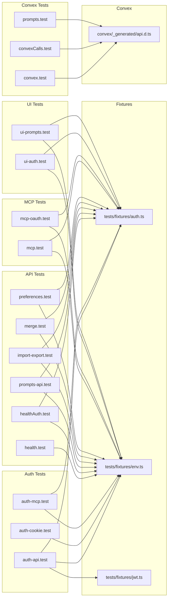
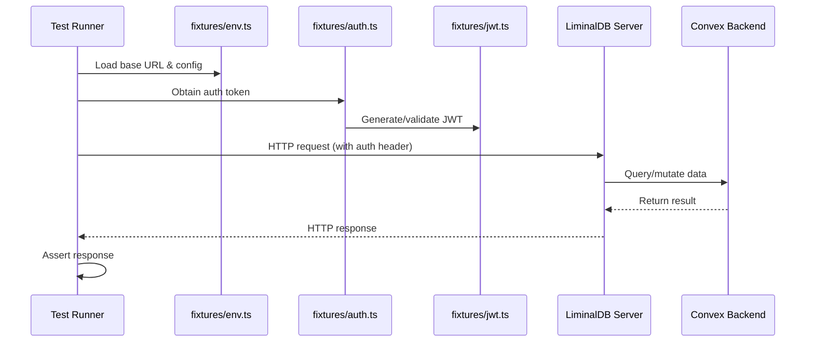

# Integration Tests

## Overview

End-to-end integration test suite for LiminalDB covering authentication flows (API, cookie, MCP), REST API endpoints, MCP protocol (including OAuth), Convex backend interactions, UI workflows, and ancillary features like import/export, merge, and preferences. All tests share common fixture utilities for environment configuration and authentication.

## Responsibilities

- Validate authentication via API tokens, cookies, and MCP-based auth flows
- Test health and authenticated health endpoints
- Verify CRUD operations on prompts through the REST API and Convex backend
- Exercise MCP tool invocations and MCP OAuth authorization flows
- Test import/export and merge functionality end-to-end
- Cover UI authentication and prompt management workflows
- Validate user preferences API behavior

## Structure Diagram

## Entity Table

| Name | Kind | Role | Public Entrypoints | Depends On | Used By |
| --- | --- | --- | --- | --- | --- |
| auth-api.test.ts | file | Tests API-level authentication (token validation, rejection of invalid tokens) | none | tests/fixtures/auth.ts, tests/fixtures/env.ts, tests/fixtures/jwt.ts | none |
| auth-cookie.test.ts | file | Tests cookie-based authentication flow | none | tests/fixtures/env.ts | none |
| auth-mcp.test.ts | file | Tests MCP-specific authentication mechanisms | none | tests/fixtures/auth.ts, tests/fixtures/env.ts | none |
| convex.test.ts | file | Basic Convex connectivity and query tests | none | convex/_generated/api.d.ts | none |
| convexCalls.test.ts | file | Tests Convex function calls (mutations/queries) | none | convex/_generated/api.d.ts | none |
| prompts.test.ts (convex) | file | Comprehensive Convex-level prompt CRUD and logic tests (513 LOC) | none | convex/_generated/api.d.ts | none |
| health.test.ts | file | Tests unauthenticated health endpoint | none | tests/fixtures/env.ts | none |
| healthAuth.test.ts | file | Tests authenticated health endpoint | none | tests/fixtures/auth.ts, tests/fixtures/env.ts | none |
| import-export.test.ts | file | Tests bulk import and export of prompt data | none | tests/fixtures/auth.ts, tests/fixtures/env.ts | none |
| mcp-oauth.test.ts | file | Tests MCP OAuth authorization flow end-to-end | none | tests/fixtures/auth.ts, tests/fixtures/env.ts | none |
| mcp.test.ts | file | Tests MCP tool invocations | none | tests/fixtures/auth.ts, tests/fixtures/env.ts | none |
| merge.test.ts | file | Tests prompt merge/conflict resolution logic | none | tests/fixtures/auth.ts, tests/fixtures/env.ts | none |
| preferences.test.ts | file | Tests user preferences API | none | tests/fixtures/auth.ts, tests/fixtures/env.ts | none |
| prompts-api.test.ts | file | Tests REST API endpoints for prompt CRUD | none | tests/fixtures/auth.ts, tests/fixtures/env.ts | none |
| ui-auth.test.ts | file | UI-level authentication flow tests | none | tests/fixtures/auth.ts, tests/fixtures/env.ts | none |
| ui-prompts.test.ts | file | UI-level prompt management workflow tests | none | tests/fixtures/auth.ts, tests/fixtures/env.ts | none |

## Key Flow

## Flow Notes

| Step | Actor/Component | Action | Output / Side Effect |
| --- | --- | --- | --- |
| 1 | Test Runner | Loads environment configuration (base URL, API keys) from fixtures/env.ts | Environment config available |
| 2 | Test Runner | Obtains authentication token via fixtures/auth.ts (and fixtures/jwt.ts for JWT-specific tests) | Valid auth token or cookie |
| 3 | Test Runner | Sends HTTP requests to the LiminalDB server with appropriate auth credentials | HTTP request dispatched |
| 4 | LiminalDB Server | Processes request, interacting with Convex backend as needed | Server response with data or error |
| 5 | Test Runner | Asserts response status, body, and side effects match expected behavior | Test pass/fail result |

## Source Coverage

- tests/integration/auth-api.test.ts
- tests/integration/auth-cookie.test.ts
- tests/integration/auth-mcp.test.ts
- tests/integration/convex.test.ts
- tests/integration/convex/convexCalls.test.ts
- tests/integration/convex/prompts.test.ts
- tests/integration/health.test.ts
- tests/integration/healthAuth.test.ts
- tests/integration/import-export.test.ts
- tests/integration/mcp-oauth.test.ts
- tests/integration/mcp.test.ts
- tests/integration/merge.test.ts
- tests/integration/preferences.test.ts
- tests/integration/prompts-api.test.ts
- tests/integration/ui/ui-auth.test.ts
- tests/integration/ui/ui-prompts.test.ts

## Cross-Module Context

- tests/integration/auth-api.test.ts -> tests/fixtures/auth.ts (usage)
- tests/integration/auth-api.test.ts -> tests/fixtures/env.ts (usage)
- tests/integration/auth-api.test.ts -> tests/fixtures/jwt.ts (usage)
- tests/integration/auth-cookie.test.ts -> tests/fixtures/env.ts (usage)
- tests/integration/auth-mcp.test.ts -> tests/fixtures/auth.ts (usage)
- tests/integration/auth-mcp.test.ts -> tests/fixtures/env.ts (usage)
- tests/integration/convex.test.ts -> convex/_generated/api.d.ts (usage)
- tests/integration/convex/convexCalls.test.ts -> convex/_generated/api.d.ts (usage)
- tests/integration/convex/prompts.test.ts -> convex/_generated/api.d.ts (usage)
- tests/integration/health.test.ts -> tests/fixtures/env.ts (usage)
- tests/integration/healthAuth.test.ts -> tests/fixtures/auth.ts (usage)
- tests/integration/healthAuth.test.ts -> tests/fixtures/env.ts (usage)
- tests/integration/import-export.test.ts -> tests/fixtures/auth.ts (usage)
- tests/integration/import-export.test.ts -> tests/fixtures/env.ts (usage)
- tests/integration/mcp-oauth.test.ts -> tests/fixtures/auth.ts (usage)
- tests/integration/mcp-oauth.test.ts -> tests/fixtures/env.ts (usage)
- tests/integration/mcp.test.ts -> tests/fixtures/auth.ts (usage)
- tests/integration/mcp.test.ts -> tests/fixtures/env.ts (usage)
- tests/integration/merge.test.ts -> tests/fixtures/auth.ts (usage)
- tests/integration/merge.test.ts -> tests/fixtures/env.ts (usage)
- tests/integration/preferences.test.ts -> tests/fixtures/auth.ts (usage)
- tests/integration/preferences.test.ts -> tests/fixtures/env.ts (usage)
- tests/integration/prompts-api.test.ts -> tests/fixtures/auth.ts (usage)
- tests/integration/prompts-api.test.ts -> tests/fixtures/env.ts (usage)
- tests/integration/ui/ui-auth.test.ts -> tests/fixtures/auth.ts (usage)
- tests/integration/ui/ui-auth.test.ts -> tests/fixtures/env.ts (usage)
- tests/integration/ui/ui-prompts.test.ts -> tests/fixtures/auth.ts (usage)
- tests/integration/ui/ui-prompts.test.ts -> tests/fixtures/env.ts (usage)
