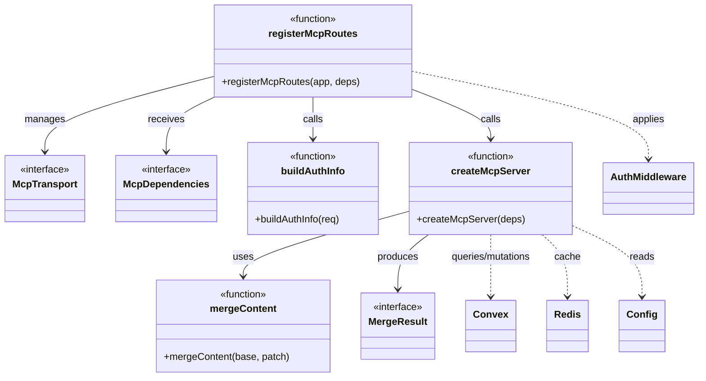
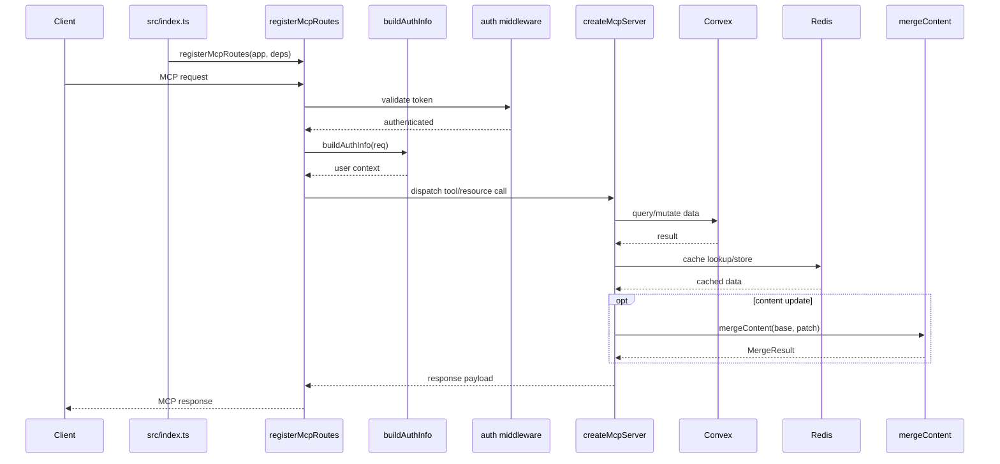

# MCP Server

## Overview

The MCP Server module implements LiminalDB's Model Context Protocol server, handling route registration, authenticated transport, tool/resource exposure, and content merging. It is composed of three files: `src/api/mcp.ts` (route registration and transport interfaces), `src/lib/mcp.ts` (core server factory with tool handlers), and `src/lib/merge.ts` (content merge utility). The module bridges incoming MCP requests through an authenticated transport layer to Convex-backed data operations, with Redis used for caching/state.

## Responsibilities

- Register MCP HTTP routes on the application server
- Define the McpTransport and McpDependencies interfaces for dependency injection
- Build authenticated user context (buildAuthInfo) from incoming requests
- Create and configure the MCP server instance with tools, resources, and prompts
- Interact with Convex backend for persistent data operations
- Cache and retrieve data via Redis
- Merge content fragments via the mergeContent utility

## Structure Diagram

## Entity Table

| Name | Kind | Role | Public Entrypoints | Depends On | Used By |
| --- | --- | --- | --- | --- | --- |
| registerMcpRoutes | function | Registers MCP HTTP endpoints on the app server, wiring transport and auth middleware | src/api/mcp.ts:registerMcpRoutes | src/lib/auth/index.ts, src/lib/config.ts, src/lib/mcp.ts, src/middleware/auth.ts | src/index.ts, tests/service/auth/mcp.test.ts, tests/service/mcp/auth-challenge.test.ts, tests/service/mcp/resources.test.ts, tests/service/mcp/tools.test.ts, tests/service/prompts/mcpTools.test.ts |
| buildAuthInfo | function | Extracts and validates authenticated user information from an incoming request | src/api/mcp.ts:buildAuthInfo | src/lib/auth/index.ts, src/lib/config.ts, src/middleware/auth.ts | src/index.ts, tests/service/auth/mcp.test.ts, tests/service/mcp/auth-challenge.test.ts |
| McpTransport | interface | Defines the transport contract for MCP message exchange | src/api/mcp.ts:McpTransport | none | src/index.ts, tests/service/mcp/tools.test.ts |
| McpDependencies | interface | Declares injectable dependencies required to bootstrap the MCP server | src/api/mcp.ts:McpDependencies | none | src/index.ts, tests/service/mcp/tools.test.ts |
| createMcpServer | function | Factory that builds the MCP server instance, registering tools, resources, and prompt handlers backed by Convex and Redis | src/lib/mcp.ts:createMcpServer | convex/_generated/api.d.ts, src/lib/config.ts, src/lib/convex.ts, src/lib/merge.ts, src/lib/redis.ts, src/schemas/preferences.ts, src/schemas/prompts.ts | src/api/mcp.ts, tests/service/mcp/toolHandlers.test.ts |
| mergeContent | function | Merges a patch into base content, returning a MergeResult with conflict information | src/lib/merge.ts:mergeContent | none | src/lib/mcp.ts, src/routes/prompts.ts, tests/service/lib/merge.test.ts |
| MergeResult | interface | Describes the outcome of a content merge including conflicts | src/lib/merge.ts:MergeResult | none | src/lib/mcp.ts, src/routes/prompts.ts, tests/service/lib/merge.test.ts |

## Key Flow

## Flow Notes

| Step | Actor/Component | Action | Output / Side Effect |
| --- | --- | --- | --- |
| 1 | AppServer | Calls registerMcpRoutes during startup to mount MCP endpoints | MCP routes registered on HTTP server |
| 2 | Client | Sends an MCP request (tool call, resource read, etc.) | Raw HTTP request received by route handler |
| 3 | Routes / AuthMiddleware | Auth middleware validates the bearer token; buildAuthInfo extracts user context | Authenticated user info or 401 rejection |
| 4 | McpServer | Dispatches to the appropriate tool or resource handler inside createMcpServer | Handler executes business logic |
| 5 | McpServer → Convex / Redis | Queries or mutates data in Convex; reads/writes Redis cache | Persistent and cached data returned |
| 6 | McpServer → mergeContent | If a content update is involved, merges patch into base content | MergeResult with merged content and conflict info |
| 7 | Routes | Serializes and returns the MCP response to the client | MCP-formatted JSON response |

## Source Coverage

- src/api/mcp.ts
- src/lib/mcp.ts
- src/lib/merge.ts

## Cross-Module Context

- src/api/mcp.ts -> src/lib/auth/index.ts (import)
- src/api/mcp.ts -> src/lib/config.ts (import)
- src/api/mcp.ts -> src/middleware/auth.ts (import)
- src/index.ts -> src/api/mcp.ts (usage)
- src/lib/mcp.ts -> convex/_generated/api.d.ts (import)
- src/lib/mcp.ts -> src/lib/config.ts (import)
- src/lib/mcp.ts -> src/lib/convex.ts (import)
- src/lib/mcp.ts -> src/lib/redis.ts (import)
- src/lib/mcp.ts -> src/schemas/preferences.ts (import)
- src/lib/mcp.ts -> src/schemas/prompts.ts (import)
- src/routes/prompts.ts -> src/lib/merge.ts (import)
- tests/service/auth/mcp.test.ts -> src/api/mcp.ts (usage)
- tests/service/lib/merge.test.ts -> src/lib/merge.ts (usage)
- tests/service/mcp/auth-challenge.test.ts -> src/api/mcp.ts (usage)
- tests/service/mcp/resources.test.ts -> src/api/mcp.ts (usage)
- tests/service/mcp/toolHandlers.test.ts -> src/lib/mcp.ts (usage)
- tests/service/mcp/tools.test.ts -> src/api/mcp.ts (usage)
- tests/service/prompts/mcpTools.test.ts -> src/api/mcp.ts (usage)
