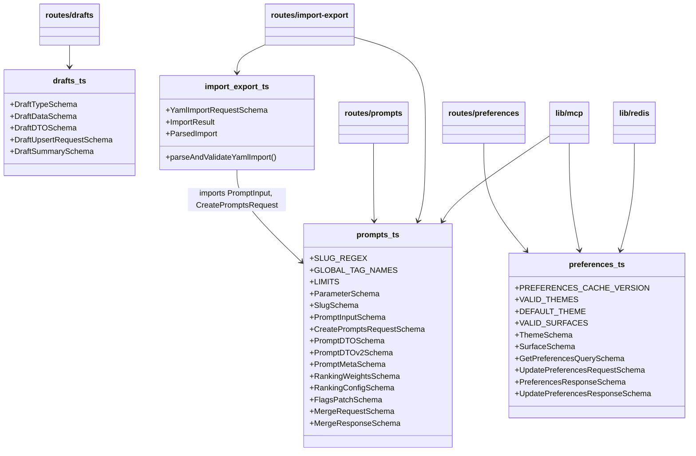
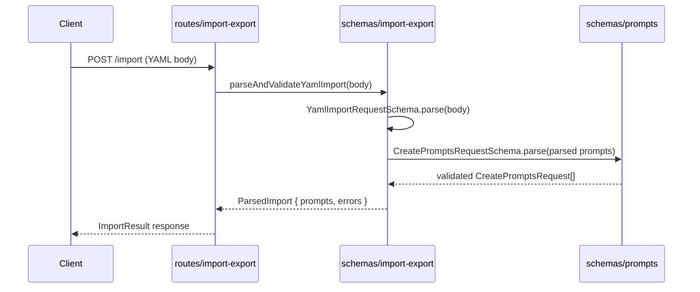

# Schemas

## Overview

The Schemas module is the central validation and type-definition layer for LiminalDB. It uses Zod to define request/response schemas for four domains—prompts, drafts, preferences, and import/export—and infers TypeScript types from those schemas. Every route handler, MCP tool, and cache layer imports from this module to ensure consistent data shapes and runtime validation across the application.

## Responsibilities

- Define Zod schemas and inferred TypeScript types for prompt CRUD, versioning (v1/v2 DTOs), ranking, flags, and merge operations
- Define draft lifecycle schemas including draft types, upsert requests, and summary projections
- Define user preference schemas for themes, surfaces, and cache versioning
- Provide YAML import parsing and validation logic that composes prompt schemas
- Export domain constants (SLUG_REGEX, LIMITS, GLOBAL_TAG_NAMES, VALID_THEMES, VALID_SURFACES) used for validation across routes and MCP tools

## Structure Diagram

## Entity Table

| Name | Kind | Role | Public Entrypoints | Depends On | Used By |
| --- | --- | --- | --- | --- | --- |
| prompts.ts | file | Core prompt domain schemas: input validation, DTO shapes (v1/v2), parameters, slugs, ranking config, flags patch, and merge request/response | src/schemas/prompts.ts | none | src/routes/prompts.ts, src/routes/import-export.ts, src/lib/mcp.ts, src/schemas/import-export.ts, tests/service/prompts/edgeCases.test.ts |
| drafts.ts | file | Draft lifecycle schemas: draft type enum, data shape, DTO, upsert request, and summary projection | src/schemas/drafts.ts | none | src/routes/drafts.ts, tests/service/drafts/drafts.test.ts |
| preferences.ts | file | User preference schemas: theme/surface enums, get/update request-response shapes, cache version constant | src/schemas/preferences.ts | none | src/routes/preferences.ts, src/routes/app.ts, src/routes/modules.ts, src/lib/mcp.ts, src/lib/redis.ts |
| import-export.ts | file | YAML import validation: request schema, parsed import and result interfaces, parseAndValidateYamlImport function | src/schemas/import-export.ts | src/schemas/prompts.ts | src/routes/import-export.ts |
| parseAndValidateYamlImport | function | Parses raw YAML string, validates against prompt schemas, and returns a ParsedImport or error | src/schemas/import-export.ts:parseAndValidateYamlImport | src/schemas/prompts.ts | src/routes/import-export.ts |

## Key Flow

## Flow Notes

| Step | Actor/Component | Action | Output / Side Effect |
| --- | --- | --- | --- |
| 1 | Client | Sends a POST request with a YAML body to the import-export route | Raw YAML payload |
| 2 | routes/import-export | Delegates to parseAndValidateYamlImport for parsing and validation | Function call with raw body |
| 3 | schemas/import-export | Validates the top-level request shape via YamlImportRequestSchema | Parsed YAML object |
| 4 | schemas/import-export | Validates each prompt entry against CreatePromptsRequestSchema from prompts.ts | Array of validated prompt inputs or per-entry errors |
| 5 | routes/import-export | Returns the ImportResult (created prompts + any validation errors) to the client | JSON response with import results |

## Source Coverage

- src/schemas/drafts.ts
- src/schemas/import-export.ts
- src/schemas/preferences.ts
- src/schemas/prompts.ts

## Cross-Module Context

- src/lib/mcp.ts -> src/schemas/preferences.ts (import)
- src/lib/mcp.ts -> src/schemas/prompts.ts (import)
- src/lib/redis.ts -> src/schemas/preferences.ts (import)
- src/routes/app.ts -> src/schemas/preferences.ts (import)
- src/routes/drafts.ts -> src/schemas/drafts.ts (import)
- src/routes/import-export.ts -> src/schemas/import-export.ts (import)
- src/routes/import-export.ts -> src/schemas/prompts.ts (import)
- src/routes/modules.ts -> src/schemas/preferences.ts (import)
- src/routes/preferences.ts -> src/schemas/preferences.ts (import)
- src/routes/prompts.ts -> src/schemas/prompts.ts (import)
- tests/service/drafts/drafts.test.ts -> src/schemas/drafts.ts (usage)
- tests/service/prompts/edgeCases.test.ts -> src/schemas/prompts.ts (usage)
