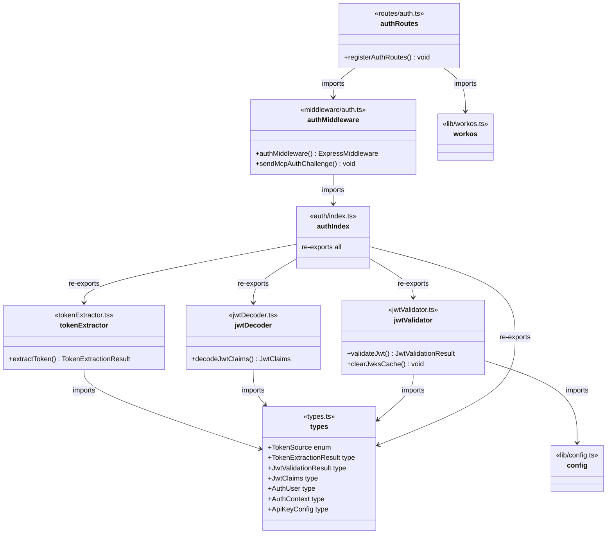
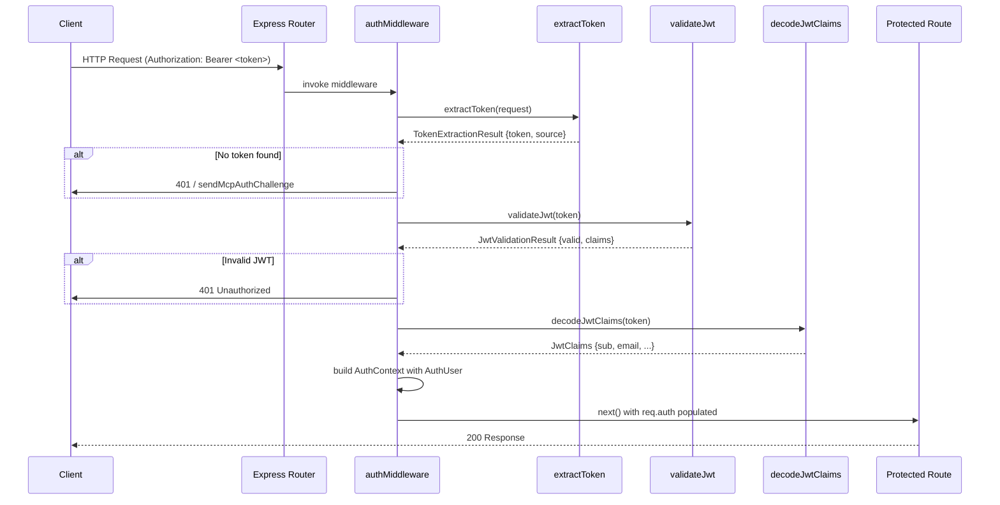

# Server Authentication

## Overview

The Server Authentication module provides JWT-based authentication for LiminalDB. It is structured as a layered pipeline: token extraction from HTTP requests, JWT decoding and cryptographic validation via JWKS, and an Express middleware that gates all protected routes. Auth routes handle WorkOS-powered login/callback flows. The module is consumed by virtually every route and API handler in the application.

## Responsibilities

- Extract bearer tokens from Authorization headers and other sources (e.g., query params)
- Decode JWT claims without verification for inspection purposes
- Validate JWTs cryptographically using JWKS with cache management
- Provide Express middleware that authenticates requests and populates AuthContext
- Send MCP-specific auth challenge responses for unauthenticated MCP clients
- Register auth routes for WorkOS login, callback, and session management
- Define shared auth types (AuthUser, AuthContext, JwtClaims, TokenSource, etc.)

## Structure Diagram

## Entity Table

| Name | Kind | Role | Public Entrypoints | Depends On | Used By |
| --- | --- | --- | --- | --- | --- |
| types.ts | type-definitions | Defines all shared auth types: TokenSource, TokenExtractionResult, JwtValidationResult, JwtClaims, AuthUser, AuthContext, ApiKeyConfig | TokenSource, TokenExtractionResult, JwtValidationResult, JwtClaims, AuthUser, AuthContext, ApiKeyConfig | none | tokenExtractor, jwtDecoder, jwtValidator, auth/index.ts |
| extractToken | function | Extracts bearer tokens from HTTP request Authorization headers or other sources, returning a TokenExtractionResult | extractToken | types.ts | auth/index.ts, src/index.ts, tests (many) |
| decodeJwtClaims | function | Decodes JWT payload claims without cryptographic verification | decodeJwtClaims | types.ts | auth/index.ts |
| validateJwt | function | Validates JWT signature and claims using JWKS endpoint, with key cache support | validateJwt, clearJwksCache | types.ts, src/lib/config.ts | auth/index.ts |
| auth/index.ts | barrel | Re-exports all auth library functions and types as a single import target | src/lib/auth/index.ts | tokenExtractor, jwtDecoder, jwtValidator, types.ts | authMiddleware, src/api/mcp.ts |
| authMiddleware | function | Express middleware that authenticates requests by extracting and validating JWTs, populating AuthContext on the request | authMiddleware, sendMcpAuthChallenge | auth/index.ts | src/routes/auth.ts, src/routes/prompts.ts, src/routes/drafts.ts, src/routes/preferences.ts, src/routes/app.ts, src/routes/import-export.ts, src/api/mcp.ts, src/api/health.ts, src/index.ts |
| registerAuthRoutes | function | Registers WorkOS-powered login, callback, and session routes on the Express app | registerAuthRoutes | authMiddleware, src/lib/workos.ts | src/index.ts |

## Key Flow

## Flow Notes

| Step | Actor/Component | Action | Output / Side Effect |
| --- | --- | --- | --- |
| 1 | Client | Sends HTTP request with Authorization: Bearer <JWT> header | Raw HTTP request reaches Express router |
| 2 | authMiddleware | Calls extractToken to pull the bearer token from the request headers or query params | TokenExtractionResult with token string and TokenSource |
| 3 | authMiddleware | Calls validateJwt to verify the token signature against WorkOS JWKS endpoint (with cache) | JwtValidationResult indicating validity and decoded claims |
| 4 | authMiddleware | Builds AuthContext containing AuthUser (sub, email) and attaches it to the request object | req.auth populated; calls next() to pass control to the route handler |
| 5 | authMiddleware | On failure, returns 401 or calls sendMcpAuthChallenge for MCP clients with proper WWW-Authenticate header | 401 response with auth challenge details |

## Source Coverage

- src/lib/auth/index.ts
- src/lib/auth/jwtDecoder.ts
- src/lib/auth/jwtValidator.ts
- src/lib/auth/tokenExtractor.ts
- src/lib/auth/types.ts
- src/middleware/auth.ts
- src/routes/auth.ts

## Cross-Module Context

- src/api/health.ts -> src/middleware/auth.ts (import)
- src/api/mcp.ts -> src/lib/auth/index.ts (import)
- src/api/mcp.ts -> src/middleware/auth.ts (import)
- src/index.ts -> src/lib/auth/tokenExtractor.ts (usage)
- src/index.ts -> src/middleware/auth.ts (usage)
- src/index.ts -> src/routes/auth.ts (usage)
- src/lib/auth/jwtValidator.ts -> src/lib/config.ts (import)
- src/routes/app.ts -> src/middleware/auth.ts (import)
- src/routes/auth.ts -> src/lib/workos.ts (import)
- src/routes/drafts.ts -> src/middleware/auth.ts (import)
- src/routes/import-export.ts -> src/middleware/auth.ts (import)
- src/routes/preferences.ts -> src/middleware/auth.ts (import)
- src/routes/prompts.ts -> src/middleware/auth.ts (import)
- tests/service/auth/mcp.test.ts -> src/lib/auth/tokenExtractor.ts (usage)
- tests/service/auth/mcp.test.ts -> src/middleware/auth.ts (usage)
- tests/service/auth/middleware.test.ts -> src/lib/auth/index.ts (usage)
- tests/service/auth/middleware.test.ts -> src/lib/auth/tokenExtractor.ts (usage)
- tests/service/auth/middleware.test.ts -> src/middleware/auth.ts (usage)
- tests/service/auth/routes.test.ts -> src/lib/auth/tokenExtractor.ts (usage)
- tests/service/auth/routes.test.ts -> src/middleware/auth.ts (usage)
- tests/service/auth/routes.test.ts -> src/routes/auth.ts (usage)
- tests/service/drafts/drafts.test.ts -> src/lib/auth/tokenExtractor.ts (usage)
- tests/service/drafts/drafts.test.ts -> src/middleware/auth.ts (usage)
- tests/service/mcp/auth-challenge.test.ts -> src/lib/auth/tokenExtractor.ts (usage)
- tests/service/mcp/auth-challenge.test.ts -> src/middleware/auth.ts (usage)
- tests/service/mcp/resources.test.ts -> src/lib/auth/tokenExtractor.ts (usage)
- tests/service/mcp/resources.test.ts -> src/middleware/auth.ts (usage)
- tests/service/mcp/tools.test.ts -> src/lib/auth/tokenExtractor.ts (usage)
- tests/service/mcp/tools.test.ts -> src/middleware/auth.ts (usage)
- tests/service/mcp/well-known.test.ts -> src/lib/auth/tokenExtractor.ts (usage)
- tests/service/mcp/well-known.test.ts -> src/middleware/auth.ts (usage)
- tests/service/preferences.test.ts -> src/lib/auth/tokenExtractor.ts (usage)
- tests/service/preferences.test.ts -> src/middleware/auth.ts (usage)
- tests/service/prompts/createPrompts.test.ts -> src/lib/auth/tokenExtractor.ts (usage)
- tests/service/prompts/createPrompts.test.ts -> src/middleware/auth.ts (usage)
- tests/service/prompts/deletePrompt.test.ts -> src/lib/auth/tokenExtractor.ts (usage)
- tests/service/prompts/deletePrompt.test.ts -> src/middleware/auth.ts (usage)
- tests/service/prompts/edgeCases.test.ts -> src/lib/auth/tokenExtractor.ts (usage)
- tests/service/prompts/edgeCases.test.ts -> src/middleware/auth.ts (usage)
- tests/service/prompts/flagsUsage.test.ts -> src/lib/auth/tokenExtractor.ts (usage)
- tests/service/prompts/flagsUsage.test.ts -> src/middleware/auth.ts (usage)
- tests/service/prompts/getPrompt.test.ts -> src/lib/auth/tokenExtractor.ts (usage)
- tests/service/prompts/getPrompt.test.ts -> src/middleware/auth.ts (usage)
- tests/service/prompts/importExport.test.ts -> src/lib/auth/tokenExtractor.ts (usage)
- tests/service/prompts/importExport.test.ts -> src/middleware/auth.ts (usage)
- tests/service/prompts/listPrompts.test.ts -> src/lib/auth/tokenExtractor.ts (usage)
- tests/service/prompts/listPrompts.test.ts -> src/middleware/auth.ts (usage)
- tests/service/prompts/mcpTools.test.ts -> src/lib/auth/tokenExtractor.ts (usage)
- tests/service/prompts/mcpTools.test.ts -> src/middleware/auth.ts (usage)
- tests/service/prompts/mergePrompt.test.ts -> src/lib/auth/tokenExtractor.ts (usage)
- tests/service/prompts/mergePrompt.test.ts -> src/middleware/auth.ts (usage)
- tests/service/prompts/updatePrompt.test.ts -> src/lib/auth/tokenExtractor.ts (usage)
- tests/service/prompts/updatePrompt.test.ts -> src/middleware/auth.ts (usage)
