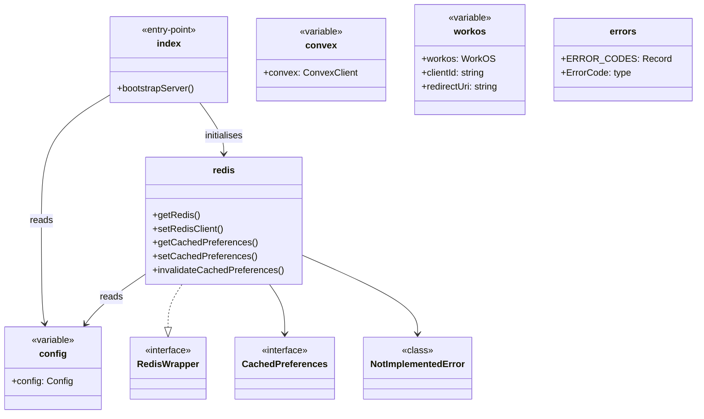
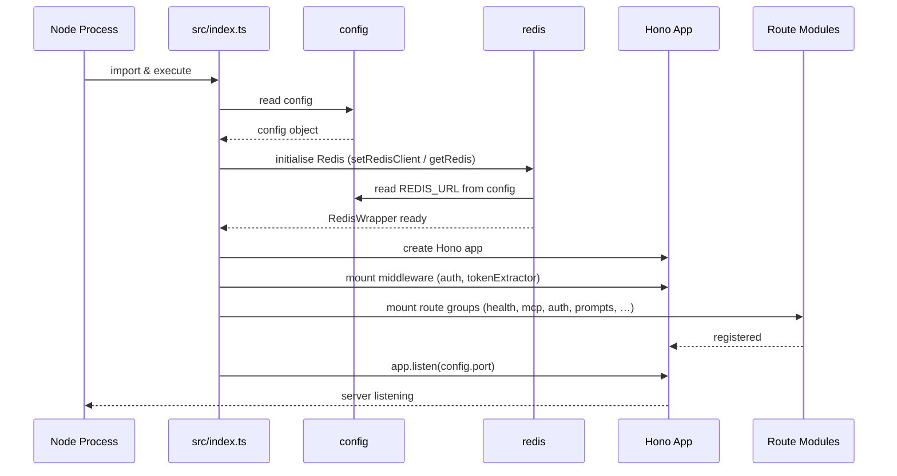

# Server Entry & Configuration

## Overview

The foundational module that bootstraps the LiminalDB server application. It owns the HTTP entry point (`src/index.ts`), centralised configuration (`config`), Convex backend client (`convex`), Redis caching layer (`redis`), WorkOS authentication client (`workos`), and a shared error-code vocabulary (`errors`). Every route, middleware, and service layer in the application depends on at least one export from this module.

## Responsibilities

- Bootstrap the Hono HTTP server, mount all route groups, middleware, and API handlers
- Provide a single `config` object that normalises environment variables for the entire app
- Initialise and export the Convex client used for backend data operations
- Manage the Redis connection and expose a caching API for user preferences
- Initialise the WorkOS SDK and expose `clientId`, `redirectUri`, and `workos` for auth flows
- Define a canonical set of `ERROR_CODES` and the `ErrorCode` type for consistent error handling

## Structure Diagram

## Entity Table

| Name | Kind | Role | Public Entrypoints | Depends On | Used By |
| --- | --- | --- | --- | --- | --- |
| src/index.ts | file | Application entry point — creates the Hono app, wires middleware, mounts routes, and starts the server | src/index.ts | config, redis, src/api/health.ts, src/api/mcp.ts, src/middleware/auth.ts, src/routes/app.ts, src/routes/auth.ts, src/routes/drafts.ts, src/routes/import-export.ts, src/routes/modules.ts, src/routes/preferences.ts, src/routes/prompts.ts, src/routes/well-known.ts | none |
| config | variable | Centralised configuration object sourced from environment variables | src/lib/config.ts:config | none | src/index.ts, src/api/health.ts, src/api/mcp.ts, src/lib/auth/jwtValidator.ts, src/lib/mcp.ts, src/lib/redis.ts, src/routes/import-export.ts, src/routes/preferences.ts, src/routes/prompts.ts |
| convex | variable | Shared Convex backend client instance | src/lib/convex.ts:convex | none | src/api/health.ts, src/lib/mcp.ts, src/routes/import-export.ts, src/routes/preferences.ts, src/routes/prompts.ts |
| ERROR_CODES / ErrorCode | constant / type | Canonical error codes and union type for consistent error responses | src/lib/errors.ts:ERROR_CODES, src/lib/errors.ts:ErrorCode | none | none |
| RedisWrapper | interface | Abstraction over the Redis client for testability | src/lib/redis.ts:RedisWrapper | config | src/lib/mcp.ts, src/routes/drafts.ts, src/routes/preferences.ts, tests/__mocks__/redis.ts |
| CachedPreferences | interface | Shape of cached user preferences stored in Redis | src/lib/redis.ts:CachedPreferences | src/schemas/preferences.ts | src/routes/preferences.ts, src/lib/mcp.ts |
| getRedis / setRedisClient | variable | Getter and setter for the module-level Redis client singleton | src/lib/redis.ts:getRedis, src/lib/redis.ts:setRedisClient | config | src/index.ts, src/routes/drafts.ts, src/lib/mcp.ts |
| getCachedPreferences / setCachedPreferences / invalidateCachedPreferences | function | Read, write, and invalidate user preference cache in Redis | src/lib/redis.ts:getCachedPreferences, src/lib/redis.ts:setCachedPreferences, src/lib/redis.ts:invalidateCachedPreferences | config, src/schemas/preferences.ts | src/routes/preferences.ts, src/lib/mcp.ts |
| workos / clientId / redirectUri | variable | WorkOS SDK instance and OAuth configuration for authentication | src/lib/workos.ts:workos, src/lib/workos.ts:clientId, src/lib/workos.ts:redirectUri | none | src/routes/auth.ts |

## Key Flow

## Flow Notes

| Step | Actor/Component | Action | Output / Side Effect |
| --- | --- | --- | --- |
| 1 | Node Process | Imports and executes src/index.ts | Module-level code runs |
| 2 | index.ts | Reads the centralised config object | Environment-derived settings available |
| 3 | index.ts | Initialises the Redis client via setRedisClient/getRedis | RedisWrapper singleton ready for caching |
| 4 | index.ts | Creates Hono app, attaches auth middleware and token extractor | Request pipeline configured |
| 5 | index.ts | Mounts all route groups (health, MCP, auth, prompts, drafts, preferences, modules, import-export, well-known, app) | All endpoints registered |
| 6 | index.ts | Starts the HTTP server on config.port | Server listening and accepting requests |

## Source Coverage

- src/index.ts
- src/lib/config.ts
- src/lib/convex.ts
- src/lib/errors.ts
- src/lib/redis.ts
- src/lib/workos.ts

## Cross-Module Context

- src/api/health.ts -> src/lib/config.ts (import)
- src/api/health.ts -> src/lib/convex.ts (import)
- src/api/mcp.ts -> src/lib/config.ts (import)
- src/index.ts -> src/api/health.ts (usage)
- src/index.ts -> src/api/mcp.ts (usage)
- src/index.ts -> src/lib/auth/tokenExtractor.ts (usage)
- src/index.ts -> src/middleware/auth.ts (usage)
- src/index.ts -> src/routes/app.ts (usage)
- src/index.ts -> src/routes/auth.ts (usage)
- src/index.ts -> src/routes/drafts.ts (usage)
- src/index.ts -> src/routes/import-export.ts (usage)
- src/index.ts -> src/routes/modules.ts (usage)
- src/index.ts -> src/routes/preferences.ts (usage)
- src/index.ts -> src/routes/prompts.ts (usage)
- src/index.ts -> src/routes/well-known.ts (usage)
- src/lib/auth/jwtValidator.ts -> src/lib/config.ts (import)
- src/lib/mcp.ts -> src/lib/config.ts (import)
- src/lib/mcp.ts -> src/lib/convex.ts (import)
- src/lib/mcp.ts -> src/lib/redis.ts (import)
- src/lib/redis.ts -> src/schemas/preferences.ts (import)
- src/routes/auth.ts -> src/lib/workos.ts (import)
- src/routes/drafts.ts -> src/lib/redis.ts (import)
- src/routes/import-export.ts -> src/lib/config.ts (import)
- src/routes/import-export.ts -> src/lib/convex.ts (import)
- src/routes/preferences.ts -> src/lib/config.ts (import)
- src/routes/preferences.ts -> src/lib/convex.ts (import)
- src/routes/preferences.ts -> src/lib/redis.ts (import)
- src/routes/prompts.ts -> src/lib/config.ts (import)
- src/routes/prompts.ts -> src/lib/convex.ts (import)
- tests/__mocks__/redis.ts -> src/lib/redis.ts (import)
- tests/service/drafts/drafts.test.ts -> src/lib/redis.ts (usage)
