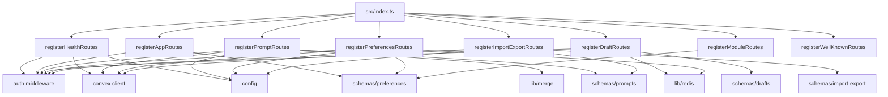
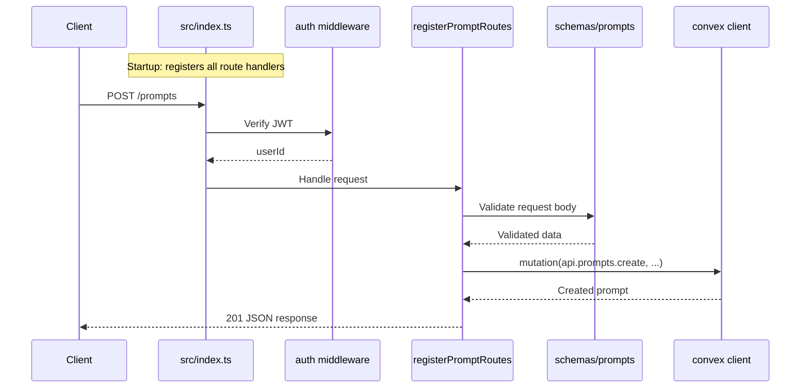

# Server Routes

## Overview

The Server Routes module contains all HTTP route handler registrations for the LiminalDB server. Each file exports a single `register*Routes` function that mounts endpoint handlers onto the application. The entry point (`src/index.ts`) calls each registration function at startup to compose the full API surface. Routes span prompts CRUD, draft management (Redis-backed), user preferences, bulk import/export, module configuration, app shell serving, well-known MCP discovery endpoints, and health checks.

## Responsibilities

- Define and register HTTP endpoints for prompt CRUD operations (create, read, update, delete, list)
- Manage draft lifecycle with Redis-backed storage
- Handle user preferences persistence via Convex and Redis
- Provide bulk import and export of prompt data
- Serve module configuration endpoints
- Serve the app shell HTML for the frontend SPA
- Expose .well-known endpoints for MCP discovery
- Expose health check endpoints with Convex connectivity status
- Apply auth middleware to protected routes

## Structure Diagram

## Entity Table

| Name | Kind | Role | Public Entrypoints | Depends On | Used By |
| --- | --- | --- | --- | --- | --- |
| registerPromptRoutes | function | Registers CRUD endpoints for prompts (largest route file at 518 LOC) | src/routes/prompts.ts:registerPromptRoutes | convex/_generated/api.d.ts, src/lib/config.ts, src/lib/convex.ts, src/lib/merge.ts, src/middleware/auth.ts, src/schemas/prompts.ts | src/index.ts, tests/service/prompts/* |
| registerDraftRoutes | function | Registers draft management endpoints backed by Redis | src/routes/drafts.ts:registerDraftRoutes | src/lib/redis.ts, src/middleware/auth.ts, src/schemas/drafts.ts | src/index.ts, tests/service/drafts/drafts.test.ts |
| registerImportExportRoutes | function | Registers bulk import and export endpoints for prompt data | src/routes/import-export.ts:registerImportExportRoutes | convex/_generated/api.d.ts, src/lib/config.ts, src/lib/convex.ts, src/middleware/auth.ts, src/schemas/import-export.ts, src/schemas/prompts.ts | src/index.ts, tests/service/prompts/importExport.test.ts |
| registerPreferencesRoutes | function | Registers user preferences endpoints with Convex + Redis caching | src/routes/preferences.ts:registerPreferencesRoutes | convex/_generated/api.d.ts, src/lib/config.ts, src/lib/convex.ts, src/lib/redis.ts, src/middleware/auth.ts, src/schemas/preferences.ts | src/index.ts |
| registerAppRoutes | function | Serves the app shell HTML for the frontend SPA | src/routes/app.ts:registerAppRoutes | src/middleware/auth.ts, src/schemas/preferences.ts | src/index.ts |
| registerModuleRoutes | function | Registers module configuration endpoints | src/routes/modules.ts:registerModuleRoutes | src/schemas/preferences.ts | src/index.ts |
| registerWellKnownRoutes | function | Exposes .well-known endpoints for MCP/OAuth discovery | src/routes/well-known.ts:registerWellKnownRoutes | none | src/index.ts, tests/service/mcp/well-known.test.ts |
| registerHealthRoutes | function | Exposes health check endpoint with Convex connectivity verification | src/api/health.ts:registerHealthRoutes | convex/_generated/api.d.ts, src/lib/config.ts, src/lib/convex.ts, src/middleware/auth.ts | src/index.ts |

## Key Flow

## Flow Notes

| Step | Actor/Component | Action | Output / Side Effect |
| --- | --- | --- | --- |
| 1 | src/index.ts | Calls each register*Routes function to mount all HTTP handlers onto the Hono app | Fully composed HTTP API surface |
| 2 | Client | Sends an HTTP request to a registered endpoint (e.g., POST /prompts) | Request enters the route handler pipeline |
| 3 | auth middleware | Validates the JWT token and extracts the authenticated user identity | userId attached to request context |
| 4 | Route handler | Validates the request body against the appropriate Zod schema | Typed, validated request data |
| 5 | Route handler | Calls Convex mutations/queries (or Redis for drafts) to perform the data operation | JSON response returned to client |

## Source Coverage

- src/api/health.ts
- src/routes/app.ts
- src/routes/drafts.ts
- src/routes/import-export.ts
- src/routes/modules.ts
- src/routes/preferences.ts
- src/routes/prompts.ts
- src/routes/well-known.ts

## Cross-Module Context

- src/api/health.ts -> convex/_generated/api.d.ts (import)
- src/api/health.ts -> src/lib/config.ts (import)
- src/api/health.ts -> src/lib/convex.ts (import)
- src/api/health.ts -> src/middleware/auth.ts (import)
- src/index.ts -> src/api/health.ts (usage)
- src/index.ts -> src/routes/app.ts (usage)
- src/index.ts -> src/routes/drafts.ts (usage)
- src/index.ts -> src/routes/import-export.ts (usage)
- src/index.ts -> src/routes/modules.ts (usage)
- src/index.ts -> src/routes/preferences.ts (usage)
- src/index.ts -> src/routes/prompts.ts (usage)
- src/index.ts -> src/routes/well-known.ts (usage)
- src/routes/app.ts -> src/middleware/auth.ts (import)
- src/routes/app.ts -> src/schemas/preferences.ts (import)
- src/routes/drafts.ts -> src/lib/redis.ts (import)
- src/routes/drafts.ts -> src/middleware/auth.ts (import)
- src/routes/drafts.ts -> src/schemas/drafts.ts (import)
- src/routes/import-export.ts -> convex/_generated/api.d.ts (import)
- src/routes/import-export.ts -> src/lib/config.ts (import)
- src/routes/import-export.ts -> src/lib/convex.ts (import)
- src/routes/import-export.ts -> src/middleware/auth.ts (import)
- src/routes/import-export.ts -> src/schemas/import-export.ts (import)
- src/routes/import-export.ts -> src/schemas/prompts.ts (import)
- src/routes/modules.ts -> src/schemas/preferences.ts (import)
- src/routes/preferences.ts -> convex/_generated/api.d.ts (import)
- src/routes/preferences.ts -> src/lib/config.ts (import)
- src/routes/preferences.ts -> src/lib/convex.ts (import)
- src/routes/preferences.ts -> src/lib/redis.ts (import)
- src/routes/preferences.ts -> src/middleware/auth.ts (import)
- src/routes/preferences.ts -> src/schemas/preferences.ts (import)
- src/routes/prompts.ts -> convex/_generated/api.d.ts (import)
- src/routes/prompts.ts -> src/lib/config.ts (import)
- src/routes/prompts.ts -> src/lib/convex.ts (import)
- src/routes/prompts.ts -> src/lib/merge.ts (import)
- src/routes/prompts.ts -> src/middleware/auth.ts (import)
- src/routes/prompts.ts -> src/schemas/prompts.ts (import)
- tests/service/drafts/drafts.test.ts -> src/routes/drafts.ts (usage)
- tests/service/mcp/well-known.test.ts -> src/routes/well-known.ts (usage)
- tests/service/prompts/createPrompts.test.ts -> src/routes/prompts.ts (usage)
- tests/service/prompts/deletePrompt.test.ts -> src/routes/prompts.ts (usage)
- tests/service/prompts/edgeCases.test.ts -> src/routes/prompts.ts (usage)
- tests/service/prompts/getPrompt.test.ts -> src/routes/prompts.ts (usage)
- tests/service/prompts/importExport.test.ts -> src/routes/import-export.ts (usage)
- tests/service/prompts/updatePrompt.test.ts -> src/routes/prompts.ts (usage)
