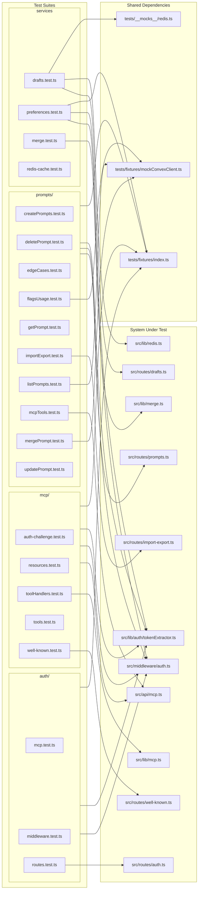
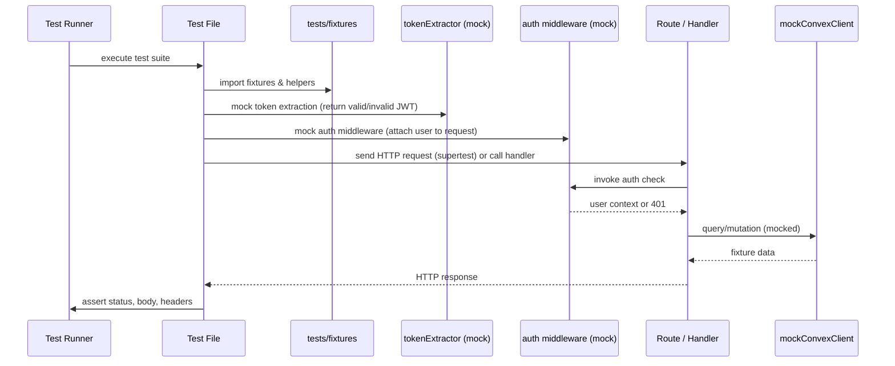

# Service Unit Tests

## Overview

Comprehensive unit test suite covering all server-side functionality of LiminalDB. The 22 test files (~5,600 LOC) are organized into four domains — auth, MCP protocol, prompts CRUD, and supporting services (drafts, preferences, merge, Redis cache). Nearly every test file depends on the shared auth middleware mock (`src/middleware/auth.ts`, `src/lib/auth/tokenExtractor.ts`) and common fixtures (`tests/fixtures/index.ts`), establishing a consistent pattern: stub authentication, exercise a route or handler, and assert HTTP responses or side effects.

## Responsibilities

- Verify auth middleware behavior including token extraction, JWT validation, and MCP-specific auth challenges
- Test auth route handlers for login/callback/session flows
- Validate MCP protocol endpoints: tool listing, tool execution, resource reads, well-known discovery, and auth challenge responses
- Cover full prompts CRUD lifecycle: create, get, list, update, delete, merge, import/export
- Exercise prompt edge cases, flags/usage tracking, and schema validation
- Test draft persistence with Redis-backed storage and schema validation
- Validate user preferences API behavior
- Unit-test the three-way merge algorithm in isolation
- Verify Redis caching layer behavior

## Structure Diagram

## Entity Table

| Name | Kind | Role | Public Entrypoints | Depends On | Used By |
| --- | --- | --- | --- | --- | --- |
| auth/mcp.test.ts | test-file | Tests MCP-specific authentication flows through the auth middleware | none | src/api/mcp.ts, src/lib/auth/tokenExtractor.ts, src/middleware/auth.ts, tests/fixtures/index.ts | none |
| auth/middleware.test.ts | test-file | Tests core auth middleware: token extraction, JWT verification, and request enrichment | none | src/lib/auth/index.ts, src/lib/auth/tokenExtractor.ts, src/middleware/auth.ts, tests/fixtures/index.ts | none |
| auth/routes.test.ts | test-file | Tests auth route handlers for login, callback, and session endpoints | none | src/lib/auth/tokenExtractor.ts, src/middleware/auth.ts, src/routes/auth.ts, tests/fixtures/index.ts | none |
| drafts/drafts.test.ts | test-file | Tests draft CRUD operations with Redis-backed storage and schema validation | none | src/lib/auth/tokenExtractor.ts, src/lib/redis.ts, src/middleware/auth.ts, src/routes/drafts.ts, src/schemas/drafts.ts, tests/__mocks__/redis.ts, tests/fixtures/index.ts | none |
| lib/merge.test.ts | test-file | Unit tests for the three-way merge algorithm in isolation | none | src/lib/merge.ts, tests/fixtures/merge.ts | none |
| mcp/auth-challenge.test.ts | test-file | Tests MCP auth challenge responses for unauthenticated requests | none | src/api/mcp.ts, src/lib/auth/tokenExtractor.ts, src/middleware/auth.ts | none |
| mcp/resources.test.ts | test-file | Tests MCP resource listing and reading endpoints | none | src/api/mcp.ts, src/lib/auth/tokenExtractor.ts, src/middleware/auth.ts, tests/fixtures/index.ts | none |
| mcp/toolHandlers.test.ts | test-file | Tests MCP tool handler implementations directly (largest MCP test at 387 LOC) | none | src/lib/mcp.ts | none |
| mcp/tools.test.ts | test-file | Tests MCP tool listing and invocation via the API layer | none | src/api/mcp.ts, src/lib/auth/tokenExtractor.ts, src/middleware/auth.ts, tests/fixtures/index.ts | none |
| mcp/well-known.test.ts | test-file | Tests .well-known endpoint for MCP/OAuth discovery metadata | none | src/lib/auth/tokenExtractor.ts, src/middleware/auth.ts, src/routes/well-known.ts | none |
| preferences.test.ts | test-file | Tests user preferences read/write API | none | src/lib/auth/tokenExtractor.ts, src/middleware/auth.ts, tests/fixtures/index.ts | none |
| prompts/createPrompts.test.ts | test-file | Tests prompt creation including validation and conflict handling | none | src/lib/auth/tokenExtractor.ts, src/middleware/auth.ts, src/routes/prompts.ts, tests/fixtures/index.ts | none |
| prompts/edgeCases.test.ts | test-file | Largest prompt test (486 LOC) covering boundary conditions and schema validation edge cases | none | src/lib/auth/tokenExtractor.ts, src/middleware/auth.ts, src/routes/prompts.ts, src/schemas/prompts.ts, tests/fixtures/index.ts | none |
| prompts/importExport.test.ts | test-file | Largest test file (724 LOC) covering bulk import/export of prompts | none | src/lib/auth/tokenExtractor.ts, src/middleware/auth.ts, src/routes/import-export.ts, tests/fixtures/index.ts | none |
| prompts/mcpTools.test.ts | test-file | Tests prompt operations exposed as MCP tools (715 LOC) | none | src/api/mcp.ts, src/lib/auth/tokenExtractor.ts, src/middleware/auth.ts, tests/fixtures/index.ts | none |
| prompts/mergePrompt.test.ts | test-file | Tests prompt merge endpoint including conflict resolution scenarios | none | src/lib/auth/tokenExtractor.ts, src/middleware/auth.ts, tests/fixtures/index.ts, tests/fixtures/mockConvexClient.ts | none |
| redis-cache.test.ts | test-file | Tests Redis caching layer behavior (get/set/invalidation) | none | none | none |

## Key Flow

## Flow Notes

| Step | Actor/Component | Action | Output / Side Effect |
| --- | --- | --- | --- |
| 1 | Test Runner | Discovers and executes test files under tests/service/ | Test suite begins execution |
| 2 | Test File | Imports shared fixtures and mocks token extractor + auth middleware to bypass real authentication | Auth layer is stubbed with deterministic user context |
| 3 | Test File | Sends HTTP requests via supertest to the route under test, or invokes handler functions directly | Route/handler receives mocked authenticated request |
| 4 | Route / Handler (SUT) | Processes request through mocked auth middleware, then calls Convex client (also mocked) for data operations | Returns HTTP response with status code and JSON body |
| 5 | Test File | Asserts on response status codes, body content, headers, and side effects (e.g., Redis calls, Convex mutations) | Pass/fail result reported to test runner |

## Source Coverage

- tests/service/auth/mcp.test.ts
- tests/service/auth/middleware.test.ts
- tests/service/auth/routes.test.ts
- tests/service/drafts/drafts.test.ts
- tests/service/lib/merge.test.ts
- tests/service/mcp/auth-challenge.test.ts
- tests/service/mcp/resources.test.ts
- tests/service/mcp/toolHandlers.test.ts
- tests/service/mcp/tools.test.ts
- tests/service/mcp/well-known.test.ts
- tests/service/preferences.test.ts
- tests/service/prompts/createPrompts.test.ts
- tests/service/prompts/deletePrompt.test.ts
- tests/service/prompts/edgeCases.test.ts
- tests/service/prompts/flagsUsage.test.ts
- tests/service/prompts/getPrompt.test.ts
- tests/service/prompts/importExport.test.ts
- tests/service/prompts/listPrompts.test.ts
- tests/service/prompts/mcpTools.test.ts
- tests/service/prompts/mergePrompt.test.ts
- tests/service/prompts/updatePrompt.test.ts
- tests/service/redis-cache.test.ts

## Cross-Module Context

- tests/service/auth/mcp.test.ts -> src/api/mcp.ts (usage)
- tests/service/auth/mcp.test.ts -> src/lib/auth/tokenExtractor.ts (usage)
- tests/service/auth/mcp.test.ts -> src/middleware/auth.ts (usage)
- tests/service/auth/mcp.test.ts -> tests/fixtures/index.ts (usage)
- tests/service/auth/middleware.test.ts -> src/lib/auth/index.ts (usage)
- tests/service/auth/middleware.test.ts -> src/lib/auth/tokenExtractor.ts (usage)
- tests/service/auth/middleware.test.ts -> src/middleware/auth.ts (usage)
- tests/service/auth/middleware.test.ts -> tests/fixtures/index.ts (usage)
- tests/service/auth/routes.test.ts -> src/lib/auth/tokenExtractor.ts (usage)
- tests/service/auth/routes.test.ts -> src/middleware/auth.ts (usage)
- tests/service/auth/routes.test.ts -> src/routes/auth.ts (usage)
- tests/service/auth/routes.test.ts -> tests/fixtures/index.ts (usage)
- tests/service/drafts/drafts.test.ts -> src/lib/auth/tokenExtractor.ts (usage)
- tests/service/drafts/drafts.test.ts -> src/lib/redis.ts (usage)
- tests/service/drafts/drafts.test.ts -> src/middleware/auth.ts (usage)
- tests/service/drafts/drafts.test.ts -> src/routes/drafts.ts (usage)
- tests/service/drafts/drafts.test.ts -> src/schemas/drafts.ts (usage)
- tests/service/drafts/drafts.test.ts -> tests/__mocks__/redis.ts (usage)
- tests/service/drafts/drafts.test.ts -> tests/fixtures/index.ts (usage)
- tests/service/lib/merge.test.ts -> src/lib/merge.ts (usage)
- tests/service/lib/merge.test.ts -> tests/fixtures/merge.ts (usage)
- tests/service/mcp/auth-challenge.test.ts -> src/api/mcp.ts (usage)
- tests/service/mcp/auth-challenge.test.ts -> src/lib/auth/tokenExtractor.ts (usage)
- tests/service/mcp/auth-challenge.test.ts -> src/middleware/auth.ts (usage)
- tests/service/mcp/resources.test.ts -> src/api/mcp.ts (usage)
- tests/service/mcp/resources.test.ts -> src/lib/auth/tokenExtractor.ts (usage)
- tests/service/mcp/resources.test.ts -> src/middleware/auth.ts (usage)
- tests/service/mcp/resources.test.ts -> tests/fixtures/index.ts (usage)
- tests/service/mcp/toolHandlers.test.ts -> src/lib/mcp.ts (usage)
- tests/service/mcp/tools.test.ts -> src/api/mcp.ts (usage)
- tests/service/mcp/tools.test.ts -> src/lib/auth/tokenExtractor.ts (usage)
- tests/service/mcp/tools.test.ts -> src/middleware/auth.ts (usage)
- tests/service/mcp/tools.test.ts -> tests/fixtures/index.ts (usage)
- tests/service/mcp/well-known.test.ts -> src/lib/auth/tokenExtractor.ts (usage)
- tests/service/mcp/well-known.test.ts -> src/middleware/auth.ts (usage)
- tests/service/mcp/well-known.test.ts -> src/routes/well-known.ts (usage)
- tests/service/preferences.test.ts -> src/lib/auth/tokenExtractor.ts (usage)
- tests/service/preferences.test.ts -> src/middleware/auth.ts (usage)
- tests/service/preferences.test.ts -> tests/fixtures/index.ts (usage)
- tests/service/prompts/createPrompts.test.ts -> src/lib/auth/tokenExtractor.ts (usage)
- tests/service/prompts/createPrompts.test.ts -> src/middleware/auth.ts (usage)
- tests/service/prompts/createPrompts.test.ts -> src/routes/prompts.ts (usage)
- tests/service/prompts/createPrompts.test.ts -> tests/fixtures/index.ts (usage)
- tests/service/prompts/deletePrompt.test.ts -> src/lib/auth/tokenExtractor.ts (usage)
- tests/service/prompts/deletePrompt.test.ts -> src/middleware/auth.ts (usage)
- tests/service/prompts/deletePrompt.test.ts -> src/routes/prompts.ts (usage)
- tests/service/prompts/deletePrompt.test.ts -> tests/fixtures/index.ts (usage)
- tests/service/prompts/edgeCases.test.ts -> src/lib/auth/tokenExtractor.ts (usage)
- tests/service/prompts/edgeCases.test.ts -> src/middleware/auth.ts (usage)
- tests/service/prompts/edgeCases.test.ts -> src/routes/prompts.ts (usage)
- tests/service/prompts/edgeCases.test.ts -> src/schemas/prompts.ts (usage)
- tests/service/prompts/edgeCases.test.ts -> tests/fixtures/index.ts (usage)
- tests/service/prompts/flagsUsage.test.ts -> src/lib/auth/tokenExtractor.ts (usage)
- tests/service/prompts/flagsUsage.test.ts -> src/middleware/auth.ts (usage)
- tests/service/prompts/flagsUsage.test.ts -> tests/fixtures/index.ts (usage)
- tests/service/prompts/flagsUsage.test.ts -> tests/fixtures/mockConvexClient.ts (usage)
- tests/service/prompts/getPrompt.test.ts -> src/lib/auth/tokenExtractor.ts (usage)
- tests/service/prompts/getPrompt.test.ts -> src/middleware/auth.ts (usage)
- tests/service/prompts/getPrompt.test.ts -> src/routes/prompts.ts (usage)
- tests/service/prompts/getPrompt.test.ts -> tests/fixtures/index.ts (usage)
- tests/service/prompts/importExport.test.ts -> src/lib/auth/tokenExtractor.ts (usage)
- tests/service/prompts/importExport.test.ts -> src/middleware/auth.ts (usage)
- tests/service/prompts/importExport.test.ts -> src/routes/import-export.ts (usage)
- tests/service/prompts/importExport.test.ts -> tests/fixtures/index.ts (usage)
- tests/service/prompts/listPrompts.test.ts -> src/lib/auth/tokenExtractor.ts (usage)
- tests/service/prompts/listPrompts.test.ts -> src/middleware/auth.ts (usage)
- tests/service/prompts/listPrompts.test.ts -> tests/fixtures/index.ts (usage)
- tests/service/prompts/listPrompts.test.ts -> tests/fixtures/mockConvexClient.ts (usage)
- tests/service/prompts/mcpTools.test.ts -> src/api/mcp.ts (usage)
- tests/service/prompts/mcpTools.test.ts -> src/lib/auth/tokenExtractor.ts (usage)
- tests/service/prompts/mcpTools.test.ts -> src/middleware/auth.ts (usage)
- tests/service/prompts/mcpTools.test.ts -> tests/fixtures/index.ts (usage)
- tests/service/prompts/mergePrompt.test.ts -> src/lib/auth/tokenExtractor.ts (usage)
- tests/service/prompts/mergePrompt.test.ts -> src/middleware/auth.ts (usage)
- tests/service/prompts/mergePrompt.test.ts -> tests/fixtures/index.ts (usage)
- tests/service/prompts/mergePrompt.test.ts -> tests/fixtures/mockConvexClient.ts (usage)
- tests/service/prompts/updatePrompt.test.ts -> src/lib/auth/tokenExtractor.ts (usage)
- tests/service/prompts/updatePrompt.test.ts -> src/middleware/auth.ts (usage)
- tests/service/prompts/updatePrompt.test.ts -> src/routes/prompts.ts (usage)
- tests/service/prompts/updatePrompt.test.ts -> tests/fixtures/index.ts (usage)
