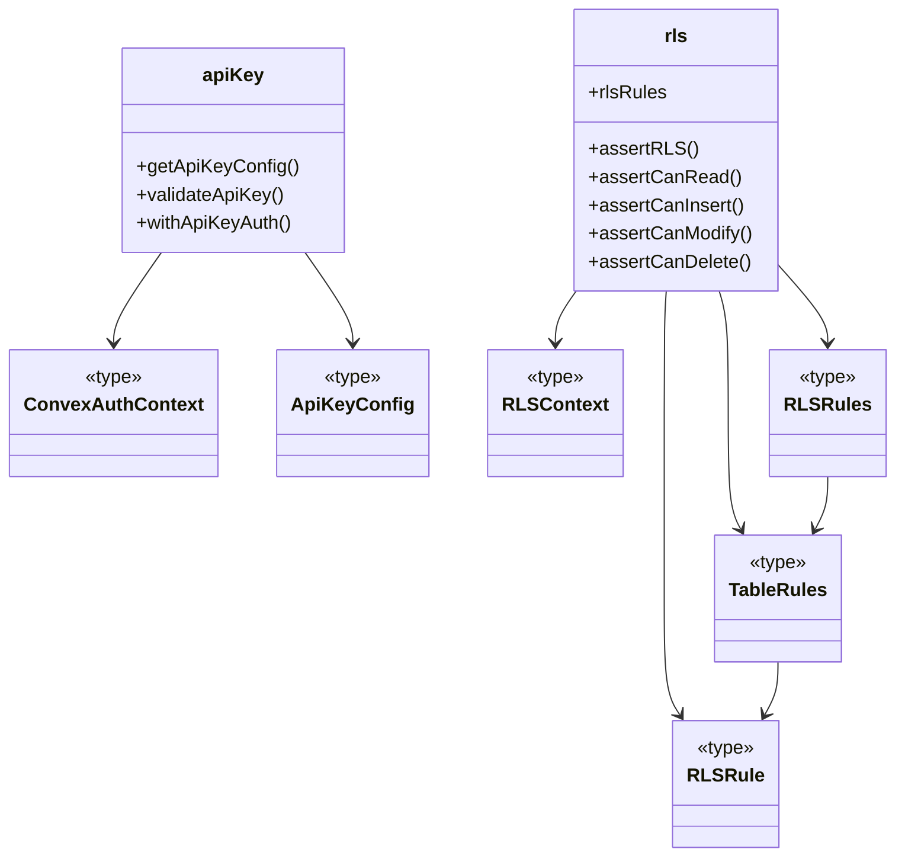
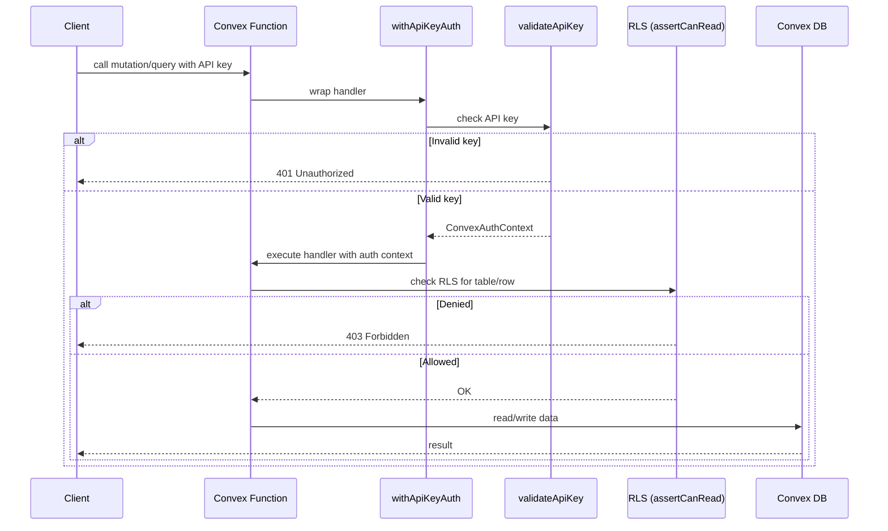

# Convex Auth & Security

## Overview

Server-side authentication and authorization layer for LiminalDB's Convex backend. This module provides API key validation, row-level security (RLS) enforcement, and shared auth type definitions consumed by all Convex mutation/query functions. It acts as the security gateway ensuring that every data operation is performed by an authenticated caller with appropriate permissions.

## Responsibilities

- Validate API keys from incoming requests against stored configuration
- Wrap Convex functions with API key authentication via `withApiKeyAuth`
- Define and enforce row-level security rules per table (read, insert, modify, delete)
- Export shared auth type definitions (`ConvexAuthContext`, `ApiKeyConfig`, `RLSContext`) for consistent typing across the codebase
- Provide granular RLS assertion helpers (`assertCanRead`, `assertCanInsert`, `assertCanModify`, `assertCanDelete`) used by data-access layers

## Structure Diagram

## Entity Table

| Name | Kind | Role | Public Entrypoints | Depends On | Used By |
| --- | --- | --- | --- | --- | --- |
| ConvexAuthContext | type | Core auth context type threaded through Convex functions | convex/auth/types.ts:ConvexAuthContext | none | convex/auth/apiKey.ts, convex/auth/rls.ts |
| ApiKeyConfig | type | Shape of API key configuration data | convex/auth/types.ts:ApiKeyConfig | none | convex/auth/apiKey.ts |
| RLSContext | type | Context passed into RLS rule evaluators | convex/auth/types.ts:RLSContext | none | convex/auth/rls.ts |
| getApiKeyConfig | function | Retrieves the API key configuration from the Convex environment | convex/auth/apiKey.ts:getApiKeyConfig | ConvexAuthContext, ApiKeyConfig | convex/prompts.ts, convex/healthAuth.ts, convex/userPreferences.ts |
| validateApiKey | function | Validates an API key against stored config; rejects unauthorized callers | convex/auth/apiKey.ts:validateApiKey | ConvexAuthContext, ApiKeyConfig | convex/prompts.ts, convex/healthAuth.ts, convex/userPreferences.ts |
| withApiKeyAuth | function | Higher-order wrapper that gates a Convex function behind API key auth | convex/auth/apiKey.ts:withApiKeyAuth | ConvexAuthContext, ApiKeyConfig | convex/prompts.ts, convex/healthAuth.ts, convex/userPreferences.ts |
| rlsRules | variable | Central registry of per-table RLS rule definitions | convex/auth/rls.ts:rlsRules | RLSContext, RLSRules | convex/model/prompts.ts, convex/userPreferences.ts |
| assertCanRead | function | Asserts the caller has read permission on a given table row | convex/auth/rls.ts:assertCanRead | RLSContext | convex/model/prompts.ts, convex/userPreferences.ts |
| assertCanInsert | function | Asserts the caller has insert permission on a given table | convex/auth/rls.ts:assertCanInsert | RLSContext | convex/model/prompts.ts, convex/userPreferences.ts |
| assertCanModify | function | Asserts the caller has modify permission on a given table row | convex/auth/rls.ts:assertCanModify | RLSContext | convex/model/prompts.ts, convex/userPreferences.ts |
| assertCanDelete | function | Asserts the caller has delete permission on a given table row | convex/auth/rls.ts:assertCanDelete | RLSContext | convex/model/prompts.ts, convex/userPreferences.ts |
| auth.config.ts | file | Convex auth provider configuration (e.g., WorkOS integration) | convex/auth.config.ts | none | none |

## Key Flow

## Flow Notes

| Step | Actor/Component | Action | Output / Side Effect |
| --- | --- | --- | --- |
| 1 | Client | Sends a Convex query or mutation with an API key in the request | Raw request reaches the Convex function endpoint |
| 2 | withApiKeyAuth | Intercepts the call and delegates to `validateApiKey` to verify the key against stored config | Returns 401 if invalid; otherwise produces a `ConvexAuthContext` |
| 3 | Convex Function | Executes business logic and calls an RLS assertion (e.g., `assertCanRead`) before data access | Returns 403 if the RLS rule denies access |
| 4 | Convex DB | Performs the authorized read or write operation | Returns the result to the client |

## Source Coverage

- convex/auth.config.ts
- convex/auth/apiKey.ts
- convex/auth/rls.ts
- convex/auth/types.ts

## Cross-Module Context

- convex/auth/apiKey.ts -> convex/_generated/server.d.ts (import)
- convex/healthAuth.ts -> convex/auth/apiKey.ts (import)
- convex/model/prompts.ts -> convex/auth/rls.ts (import)
- convex/prompts.ts -> convex/auth/apiKey.ts (import)
- convex/userPreferences.ts -> convex/auth/apiKey.ts (import)
- convex/userPreferences.ts -> convex/auth/rls.ts (import)
- tests/convex/auth/apiKey.test.ts -> convex/auth/apiKey.ts (usage)
- tests/convex/auth/rls.test.ts -> convex/auth/rls.ts (usage)
- tests/convex/healthAuth.test.ts -> convex/auth/apiKey.ts (usage)
- tests/convex/healthAuth.test.ts -> convex/auth/types.ts (usage)
