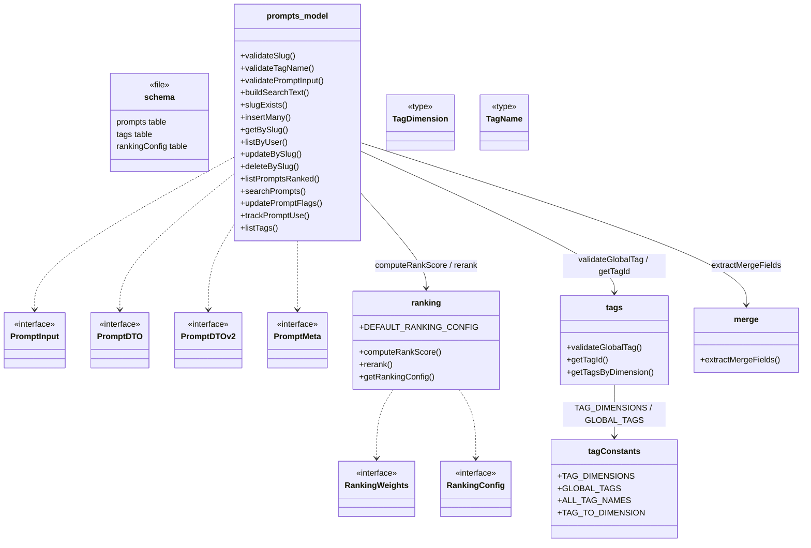
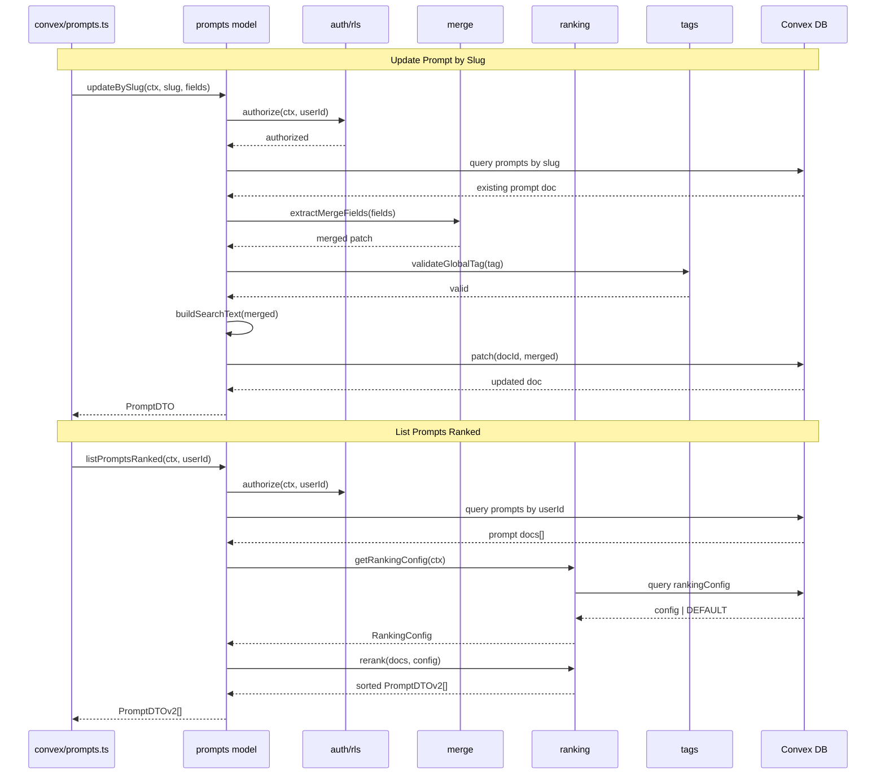

# Convex Data Model

## Overview

The Convex Data Model module defines the core domain layer for LiminalDB's prompt management system. It encompasses the database schema (`convex/schema.ts`), prompt CRUD and query logic (`model/prompts.ts`), a configurable ranking engine (`model/ranking.ts`), a taxonomy of tags organized by dimension (`model/tags.ts`, `model/tagConstants.ts`), and partial-update merge logic (`model/merge.ts`). All model functions operate against the Convex database context and enforce row-level security via `convex/auth/rls.ts`. The API layer (`convex/prompts.ts`) delegates directly to this module.

## Responsibilities

- Define the Convex database schema for prompts, tags, ranking config, and related tables
- Validate prompt inputs, slugs, and tag names before persistence
- Provide slug-based CRUD operations (insert, get, update, delete) with RLS enforcement
- Build full-text search indexes and execute prompt search queries
- Compute and apply rank scores using configurable weights (recency, usage, favorites)
- Manage a fixed taxonomy of global tags grouped by dimension
- Extract merge-safe partial fields for prompt updates

## Structure Diagram

## Entity Table

| Name | Kind | Role | Public Entrypoints | Depends On | Used By |
| --- | --- | --- | --- | --- | --- |
| schema.ts | file | Defines Convex database tables (prompts, tags, rankingConfig) with indexes and validators | convex/schema.ts | none | convex/_generated/dataModel.d.ts |
| PromptInput | interface | Input shape for creating or updating a prompt | convex/model/prompts.ts:PromptInput | none | convex/prompts.ts |
| PromptDTO | interface | Data transfer object returned from prompt queries (v1) | convex/model/prompts.ts:PromptDTO | none | convex/prompts.ts |
| PromptDTOv2 | interface | Extended prompt DTO with ranking and tag metadata (v2) | convex/model/prompts.ts:PromptDTOv2 | none | convex/prompts.ts |
| PromptMeta | interface | Lightweight prompt metadata subset | convex/model/prompts.ts:PromptMeta | none | convex/prompts.ts |
| insertMany | function | Batch-insert validated prompts for a user | convex/model/prompts.ts:insertMany | validatePromptInput, buildSearchText | convex/prompts.ts |
| getBySlug | function | Retrieve a single prompt by its unique slug | convex/model/prompts.ts:getBySlug | convex/auth/rls.ts | convex/prompts.ts |
| updateBySlug | function | Partially update a prompt, merging only supplied fields | convex/model/prompts.ts:updateBySlug | extractMergeFields, buildSearchText, convex/auth/rls.ts | convex/prompts.ts |
| deleteBySlug | function | Soft- or hard-delete a prompt by slug | convex/model/prompts.ts:deleteBySlug | convex/auth/rls.ts | convex/prompts.ts |
| listPromptsRanked | function | List prompts ordered by computed rank score | convex/model/prompts.ts:listPromptsRanked | getRankingConfig, computeRankScore | convex/prompts.ts |
| searchPrompts | function | Full-text search over prompt content using buildSearchText index | convex/model/prompts.ts:searchPrompts | buildSearchText | convex/prompts.ts |
| trackPromptUse | function | Increment usage counter on a prompt | convex/model/prompts.ts:trackPromptUse | none | convex/prompts.ts |
| computeRankScore | function | Calculate a weighted rank score from recency, usage, and favorite signals | convex/model/ranking.ts:computeRankScore | RankingWeights | convex/model/prompts.ts |
| rerank | function | Re-sort a prompt list by freshly computed rank scores | convex/model/ranking.ts:rerank | computeRankScore, getRankingConfig | convex/model/prompts.ts |
| getRankingConfig | function | Load persisted ranking config or fall back to defaults | convex/model/ranking.ts:getRankingConfig | DEFAULT_RANKING_CONFIG | convex/model/prompts.ts, convex/migrations/seedRankingConfig.ts |
| DEFAULT_RANKING_CONFIG | constant | Fallback ranking weights when no config row exists | convex/model/ranking.ts:DEFAULT_RANKING_CONFIG | none | getRankingConfig, convex/migrations/seedRankingConfig.ts |
| TAG_DIMENSIONS | constant | Enumeration of tag dimension categories | convex/model/tagConstants.ts:TAG_DIMENSIONS | none | convex/model/tags.ts, convex/migrations/seedGlobalTags.ts |
| GLOBAL_TAGS | constant | Master list of global tags keyed by dimension | convex/model/tagConstants.ts:GLOBAL_TAGS | none | convex/model/tags.ts, convex/migrations/seedGlobalTags.ts |
| validateGlobalTag | function | Assert a tag name is in the global taxonomy | convex/model/tags.ts:validateGlobalTag | ALL_TAG_NAMES | convex/model/prompts.ts |
| getTagId | function | Resolve a tag name to its Convex document ID | convex/model/tags.ts:getTagId | convex/_generated/dataModel.d.ts | convex/model/prompts.ts |
| getTagsByDimension | function | List all tags belonging to a given dimension | convex/model/tags.ts:getTagsByDimension | TAG_DIMENSIONS, convex/_generated/dataModel.d.ts | convex/model/prompts.ts |
| extractMergeFields | function | Pick only defined fields from an update payload for safe partial merge | convex/model/merge.ts:extractMergeFields | none | convex/model/prompts.ts |

## Key Flow

## Flow Notes

| Step | Actor/Component | Action | Output / Side Effect |
| --- | --- | --- | --- |
| 1 | API layer (convex/prompts.ts) | Receives client call and delegates to the prompts model function | Function invocation with Convex context |
| 2 | prompts model | Enforces row-level security via auth/rls before any data access | Authorization check pass/fail |
| 3 | prompts model | Queries Convex DB for existing prompt by slug index | Prompt document or null |
| 4 | merge | extractMergeFields strips undefined keys from the update payload | Clean partial patch object |
| 5 | tags | validateGlobalTag ensures any supplied tags exist in the taxonomy | Validation pass or error thrown |
| 6 | prompts model | Rebuilds search text and persists the patched document | Updated prompt stored in DB |
| 7 | ranking | getRankingConfig loads weights; rerank sorts by computed score | Sorted prompt list returned to caller |

## Source Coverage

- convex/model/merge.ts
- convex/model/prompts.ts
- convex/model/ranking.ts
- convex/model/tagConstants.ts
- convex/model/tags.ts
- convex/schema.ts

## Cross-Module Context

- convex/migrations/backfillSearchText.ts -> convex/model/prompts.ts (import)
- convex/migrations/seedGlobalTags.ts -> convex/model/tagConstants.ts (import)
- convex/migrations/seedRankingConfig.ts -> convex/model/ranking.ts (import)
- convex/model/prompts.ts -> convex/_generated/dataModel.d.ts (import)
- convex/model/prompts.ts -> convex/_generated/server.d.ts (import)
- convex/model/prompts.ts -> convex/auth/rls.ts (import)
- convex/model/ranking.ts -> convex/_generated/server.d.ts (import)
- convex/model/tags.ts -> convex/_generated/dataModel.d.ts (import)
- convex/model/tags.ts -> convex/_generated/server.d.ts (import)
- convex/prompts.ts -> convex/model/prompts.ts (import)
- tests/convex/prompts/deleteBySlug.test.ts -> convex/model/prompts.ts (usage)
- tests/convex/prompts/getPromptBySlug.test.ts -> convex/model/prompts.ts (usage)
- tests/convex/prompts/insertPrompts.test.ts -> convex/model/prompts.ts (usage)
- tests/convex/prompts/mergeFields.test.ts -> convex/model/merge.ts (usage)
- tests/convex/prompts/ranking.test.ts -> convex/model/ranking.ts (usage)
- tests/convex/prompts/searchPrompts.test.ts -> convex/model/prompts.ts (usage)
- tests/convex/prompts/slugExists.test.ts -> convex/model/prompts.ts (usage)
- tests/convex/prompts/usageTracking.test.ts -> convex/model/prompts.ts (usage)
- tests/convex/prompts/validation.test.ts -> convex/model/prompts.ts (usage)
- tests/convex/tags/tagConstants.test.ts -> convex/model/tagConstants.ts (usage)
- tests/convex/tags/tags.test.ts -> convex/model/tagConstants.ts (usage)
- tests/convex/tags/tags.test.ts -> convex/model/tags.ts (usage)
