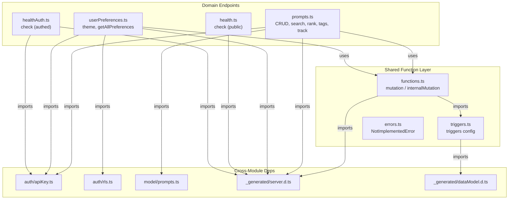
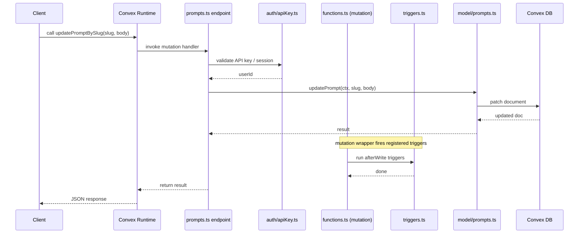

# Convex Functions & Endpoints

## Overview

This module defines the Convex query and mutation endpoints that form LiminalDB's backend API surface. It is organized around a shared function layer (`functions.ts`) that wraps Convex's generated `mutation` and `internalMutation` with trigger support, which is then consumed by domain-specific endpoint files for prompts, user preferences, and health checks. Authentication is delegated to cross-module helpers (`auth/apiKey.ts`, `auth/rls.ts`), and data access is delegated to model helpers (`model/prompts.ts`).

## Responsibilities

- Define public query/mutation endpoints for prompt CRUD, search, ranking, tagging, and usage tracking
- Define query/mutation endpoints for user theme and preference management with row-level security
- Provide trigger-aware `mutation` and `internalMutation` wrappers used by all endpoint files
- Expose unauthenticated and authenticated health-check queries
- Register database triggers via the triggers configuration
- Export a `NotImplementedError` utility class for stubbed functionality

## Structure Diagram

## Entity Table

| Name | Kind | Role | Public Entrypoints | Depends On | Used By |
| --- | --- | --- | --- | --- | --- |
| mutation | variable | Trigger-aware mutation wrapper used by all endpoint files | convex/functions.ts:mutation | convex/_generated/server.d.ts, convex/triggers.ts | convex/prompts.ts, convex/userPreferences.ts |
| internalMutation | variable | Trigger-aware internal mutation wrapper | convex/functions.ts:internalMutation | convex/_generated/server.d.ts, convex/triggers.ts | convex/prompts.ts, convex/userPreferences.ts |
| triggers | variable | Database trigger configuration consumed by the function wrappers | convex/triggers.ts:triggers | convex/_generated/dataModel.d.ts | convex/functions.ts |
| insertPrompts | variable | Mutation to insert one or more prompts | convex/prompts.ts:insertPrompts | convex/functions.ts, convex/auth/apiKey.ts, convex/model/prompts.ts | none |
| getPromptBySlug | variable | Query to retrieve a single prompt by slug | convex/prompts.ts:getPromptBySlug | convex/functions.ts, convex/auth/apiKey.ts, convex/model/prompts.ts | none |
| listPrompts | variable | Query to list prompts for a user | convex/prompts.ts:listPrompts | convex/functions.ts, convex/auth/apiKey.ts, convex/model/prompts.ts | none |
| updatePromptBySlug | variable | Mutation to update a prompt identified by slug | convex/prompts.ts:updatePromptBySlug | convex/functions.ts, convex/auth/apiKey.ts, convex/model/prompts.ts | none |
| deletePromptBySlug | variable | Mutation to delete a prompt identified by slug | convex/prompts.ts:deletePromptBySlug | convex/functions.ts, convex/auth/apiKey.ts, convex/model/prompts.ts | none |
| listPromptsRanked | variable | Query to list prompts sorted by ranking/usage | convex/prompts.ts:listPromptsRanked | convex/functions.ts, convex/auth/apiKey.ts, convex/model/prompts.ts | none |
| searchPrompts | variable | Query to full-text search prompts | convex/prompts.ts:searchPrompts | convex/functions.ts, convex/auth/apiKey.ts, convex/model/prompts.ts | none |
| updatePromptFlags | variable | Mutation to toggle prompt flags (e.g., pinned, archived) | convex/prompts.ts:updatePromptFlags | convex/functions.ts, convex/auth/apiKey.ts, convex/model/prompts.ts | none |
| trackPromptUse | variable | Mutation to record prompt usage for ranking | convex/prompts.ts:trackPromptUse | convex/functions.ts, convex/auth/apiKey.ts, convex/model/prompts.ts | none |
| listTags | variable | Query to list distinct tags across prompts | convex/prompts.ts:listTags | convex/functions.ts, convex/auth/apiKey.ts, convex/model/prompts.ts | none |
| getThemePreference | variable | Query to read the current user's theme preference | convex/userPreferences.ts:getThemePreference | convex/functions.ts, convex/auth/apiKey.ts, convex/auth/rls.ts | none |
| updateThemePreference | variable | Mutation to update the current user's theme preference | convex/userPreferences.ts:updateThemePreference | convex/functions.ts, convex/auth/apiKey.ts, convex/auth/rls.ts | none |
| getAllPreferences | variable | Query to retrieve all preferences for the current user | convex/userPreferences.ts:getAllPreferences | convex/functions.ts, convex/auth/apiKey.ts, convex/auth/rls.ts | none |
| check (health) | variable | Unauthenticated health-check query | convex/health.ts:check | convex/_generated/server.d.ts | none |
| check (healthAuth) | variable | Authenticated health-check query validating API key | convex/healthAuth.ts:check | convex/_generated/server.d.ts, convex/auth/apiKey.ts | none |
| NotImplementedError | class | Custom error for unimplemented functionality stubs | convex/errors.ts:NotImplementedError | none | none |

## Key Flow

## Flow Notes

| Step | Actor/Component | Action | Output / Side Effect |
| --- | --- | --- | --- |
| 1 | Client | Calls a Convex mutation/query endpoint (e.g., updatePromptBySlug) | Request reaches the Convex runtime |
| 2 | Endpoint (prompts.ts / userPreferences.ts) | Authenticates the request via auth/apiKey.ts (and optionally auth/rls.ts for preferences) | Resolved userId or rejection |
| 3 | Endpoint | Delegates data operations to the model layer (model/prompts.ts) or direct DB calls | Database read/write result |
| 4 | functions.ts (mutation wrapper) | After the handler completes, fires any registered triggers from triggers.ts | Trigger side-effects executed |
| 5 | Convex Runtime | Serializes response and returns to client | JSON response delivered to caller |

## Source Coverage

- convex/errors.ts
- convex/functions.ts
- convex/health.ts
- convex/healthAuth.ts
- convex/prompts.ts
- convex/triggers.ts
- convex/userPreferences.ts

## Cross-Module Context

- convex/functions.ts -> convex/_generated/server.d.ts (import)
- convex/health.ts -> convex/_generated/server.d.ts (import)
- convex/healthAuth.ts -> convex/_generated/server.d.ts (import)
- convex/healthAuth.ts -> convex/auth/apiKey.ts (import)
- convex/prompts.ts -> convex/_generated/server.d.ts (import)
- convex/prompts.ts -> convex/auth/apiKey.ts (import)
- convex/prompts.ts -> convex/model/prompts.ts (import)
- convex/triggers.ts -> convex/_generated/dataModel.d.ts (import)
- convex/userPreferences.ts -> convex/_generated/server.d.ts (import)
- convex/userPreferences.ts -> convex/auth/apiKey.ts (import)
- convex/userPreferences.ts -> convex/auth/rls.ts (import)
