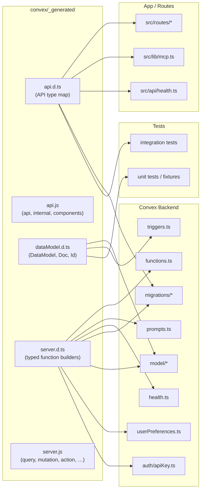
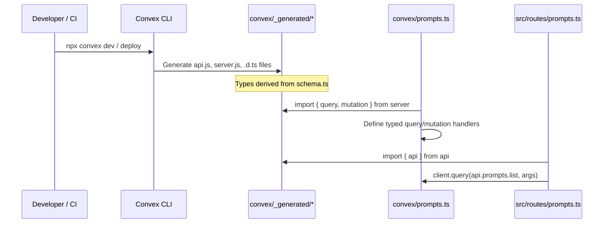

# Convex Generated

## Overview

Auto-generated Convex framework files that provide type-safe API bindings, data model types, and server function builders. These files are produced by the Convex CLI during development and deployment, forming the typed bridge between user-authored Convex functions and the Convex runtime. Nearly every backend module in LiminalDB imports from this generated layer.

## Responsibilities

- Expose typed `api` and `internal` references for invoking Convex functions from client and server code
- Provide typed `query`, `mutation`, `action`, and `httpAction` builders (plus internal variants) used to define all Convex functions
- Export `DataModel` and `Doc` / `Id` type aliases derived from the project schema for type-safe document access
- Re-export Convex framework generics parameterized to the project's specific schema

## Structure Diagram

## Entity Table

| Name | Kind | Role | Public Entrypoints | Depends On | Used By |
| --- | --- | --- | --- | --- | --- |
| api.d.ts | file | Type-level map of all public and internal Convex function references, enabling typed client calls | convex/_generated/api.d.ts | none | src/routes/prompts.ts, src/routes/preferences.ts, src/routes/import-export.ts, src/lib/mcp.ts, src/api/health.ts, convex/migrations/backfillSearchText.ts, tests/integration/* |
| api.js | file | Runtime API object exporting `api`, `internal`, and `components` references used to call Convex functions | api, internal, components | none | none |
| dataModel.d.ts | file | Project-specific DataModel, Doc, and Id type aliases derived from the Convex schema | convex/_generated/dataModel.d.ts | none | convex/model/prompts.ts, convex/model/tags.ts, convex/triggers.ts, tests/fixtures/mockConvexCtx.ts, tests/convex/prompts/insertPrompts.test.ts |
| server.d.ts | file | Typed function builder declarations (query, mutation, action, httpAction + internal variants) parameterized to the project schema | convex/_generated/server.d.ts | none | convex/functions.ts, convex/prompts.ts, convex/health.ts, convex/healthAuth.ts, convex/auth/apiKey.ts, convex/model/prompts.ts, convex/model/ranking.ts, convex/model/tags.ts, convex/userPreferences.ts, convex/migrations/* |
| server.js | file | Runtime exports of function builders: query, internalQuery, mutation, internalMutation, action, internalAction, httpAction | query, internalQuery, mutation, internalMutation, action, internalAction, httpAction | none | none |

## Key Flow

## Flow Notes

| Step | Actor/Component | Action | Output / Side Effect |
| --- | --- | --- | --- |
| 1 | Convex CLI | Reads schema.ts and function files, generates typed bindings in convex/_generated/ | api.js, api.d.ts, server.js, server.d.ts, dataModel.d.ts |
| 2 | Backend function (e.g. prompts.ts) | Imports typed builders (query, mutation) from server.js / server.d.ts to define Convex functions | Type-safe function definitions with schema-aware context |
| 3 | Client code (e.g. src/routes/prompts.ts) | Imports `api` from api.d.ts to reference functions by name with full type inference | Typed function references passed to Convex client for queries/mutations |
| 4 | Model layer (e.g. model/prompts.ts) | Imports Doc/Id types from dataModel.d.ts for type-safe document manipulation | Strongly typed document helpers and database operations |

## Source Coverage

- convex/_generated/api.d.ts
- convex/_generated/api.js
- convex/_generated/dataModel.d.ts
- convex/_generated/server.d.ts
- convex/_generated/server.js

## Cross-Module Context

- convex/auth/apiKey.ts -> convex/_generated/server.d.ts (import)
- convex/functions.ts -> convex/_generated/server.d.ts (import)
- convex/health.ts -> convex/_generated/server.d.ts (import)
- convex/healthAuth.ts -> convex/_generated/server.d.ts (import)
- convex/migrations/backfillSearchText.ts -> convex/_generated/api.d.ts (import)
- convex/migrations/backfillSearchText.ts -> convex/_generated/server.d.ts (import)
- convex/migrations/migrationStatus.ts -> convex/_generated/server.d.ts (import)
- convex/migrations/seedGlobalTags.ts -> convex/_generated/server.d.ts (import)
- convex/migrations/seedRankingConfig.ts -> convex/_generated/server.d.ts (import)
- convex/model/prompts.ts -> convex/_generated/dataModel.d.ts (import)
- convex/model/prompts.ts -> convex/_generated/server.d.ts (import)
- convex/model/ranking.ts -> convex/_generated/server.d.ts (import)
- convex/model/tags.ts -> convex/_generated/dataModel.d.ts (import)
- convex/model/tags.ts -> convex/_generated/server.d.ts (import)
- convex/prompts.ts -> convex/_generated/server.d.ts (import)
- convex/triggers.ts -> convex/_generated/dataModel.d.ts (import)
- convex/userPreferences.ts -> convex/_generated/server.d.ts (import)
- src/api/health.ts -> convex/_generated/api.d.ts (import)
- src/lib/mcp.ts -> convex/_generated/api.d.ts (import)
- src/routes/import-export.ts -> convex/_generated/api.d.ts (import)
- src/routes/preferences.ts -> convex/_generated/api.d.ts (import)
- src/routes/prompts.ts -> convex/_generated/api.d.ts (import)
- tests/convex/prompts/insertPrompts.test.ts -> convex/_generated/dataModel.d.ts (usage)
- tests/convex/tags/tags.test.ts -> convex/_generated/server.d.ts (usage)
- tests/fixtures/mockConvexCtx.ts -> convex/_generated/dataModel.d.ts (import)
- tests/integration/convex.test.ts -> convex/_generated/api.d.ts (usage)
- tests/integration/convex/convexCalls.test.ts -> convex/_generated/api.d.ts (usage)
- tests/integration/convex/prompts.test.ts -> convex/_generated/api.d.ts (usage)
