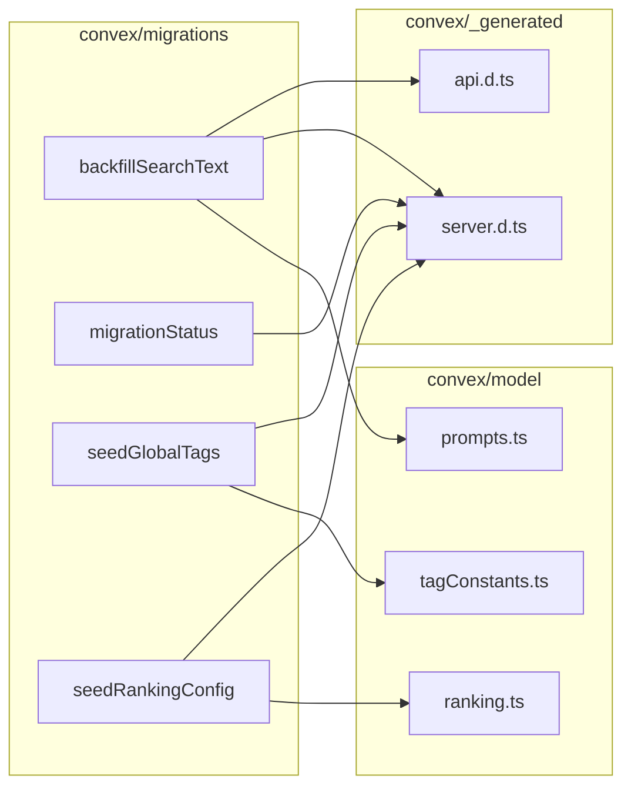
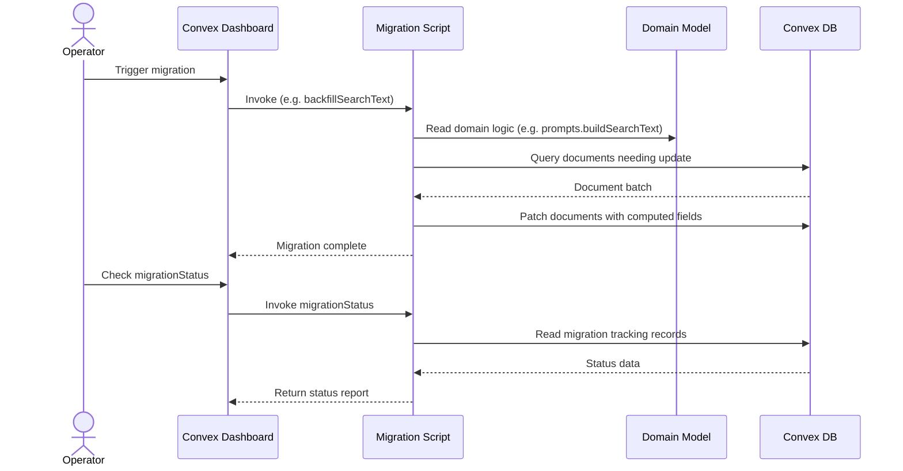

# Convex Migrations

## Overview

A set of Convex server-side migration scripts responsible for one-time or repeatable data transformations in LiminalDB. Each migration is a standalone exported variable (Convex action/mutation) that backfills, seeds, or reports on data. The module depends on domain models (`prompts`, `tagConstants`, `ranking`) and the Convex generated server runtime.

## Responsibilities

- Backfill search text on existing prompt documents by computing and persisting a searchable text field
- Seed the database with a canonical set of global tags from tagConstants
- Seed default ranking configuration from the ranking model
- Report migration completion status across all migration scripts

## Structure Diagram

## Entity Table

| Name | Kind | Role | Public Entrypoints | Depends On | Used By |
| --- | --- | --- | --- | --- | --- |
| backfillSearchText | variable | Migration that iterates prompt documents and computes/persists a searchable text field | convex/migrations/backfillSearchText.ts:backfillSearchText | convex/_generated/api.d.ts, convex/_generated/server.d.ts, convex/model/prompts.ts | none |
| migrationStatus | variable | Query that reports the completion status of registered migrations | convex/migrations/migrationStatus.ts:migrationStatus | convex/_generated/server.d.ts | none |
| seedGlobalTags | variable | Migration that seeds the database with the canonical global tag set | convex/migrations/seedGlobalTags.ts:seedGlobalTags | convex/_generated/server.d.ts, convex/model/tagConstants.ts | none |
| seedRankingConfig | variable | Migration that seeds default ranking configuration values | convex/migrations/seedRankingConfig.ts:seedRankingConfig | convex/_generated/server.d.ts, convex/model/ranking.ts | none |

## Key Flow

## Flow Notes

| Step | Actor/Component | Action | Output / Side Effect |
| --- | --- | --- | --- |
| 1 | Operator | Triggers a migration script via Convex Dashboard or CLI | Migration function is invoked on the Convex backend |
| 2 | Migration Script | Reads domain model helpers (e.g. prompts, tagConstants, ranking) to determine correct data shape | Computed values ready for persistence |
| 3 | Migration Script | Queries and patches documents in the Convex database in batches | Documents updated with backfilled/seeded data |
| 4 | Operator | Invokes migrationStatus to verify all migrations have completed | Status report of migration completion |

## Source Coverage

- convex/migrations/backfillSearchText.ts
- convex/migrations/migrationStatus.ts
- convex/migrations/seedGlobalTags.ts
- convex/migrations/seedRankingConfig.ts

## Cross-Module Context

- convex/migrations/backfillSearchText.ts -> convex/_generated/api.d.ts (import)
- convex/migrations/backfillSearchText.ts -> convex/_generated/server.d.ts (import)
- convex/migrations/backfillSearchText.ts -> convex/model/prompts.ts (import)
- convex/migrations/migrationStatus.ts -> convex/_generated/server.d.ts (import)
- convex/migrations/seedGlobalTags.ts -> convex/_generated/server.d.ts (import)
- convex/migrations/seedGlobalTags.ts -> convex/model/tagConstants.ts (import)
- convex/migrations/seedRankingConfig.ts -> convex/_generated/server.d.ts (import)
- convex/migrations/seedRankingConfig.ts -> convex/model/ranking.ts (import)
