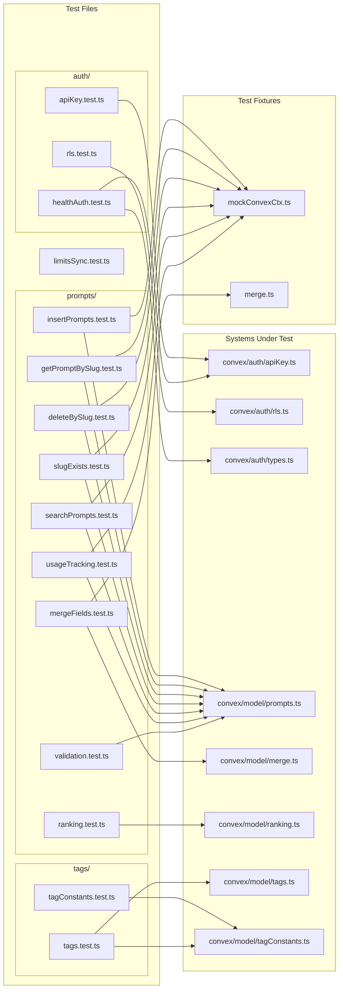
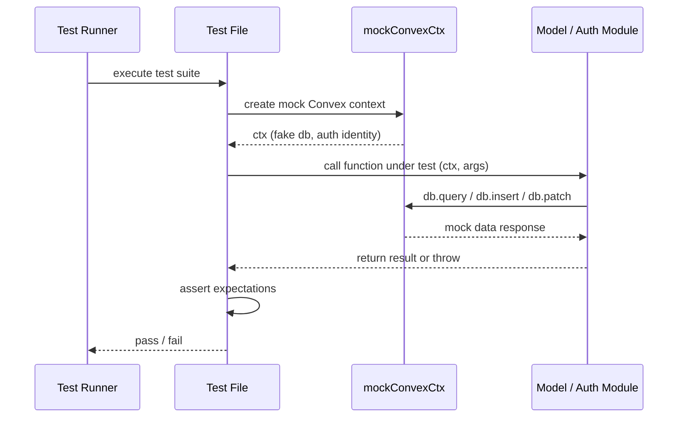

# Convex Unit Tests

## Overview

Unit test suite covering the Convex backend layer of LiminalDB. Tests are organized into three domains — **auth** (API key validation, row-level security, health-check auth), **prompts** (CRUD operations, validation, ranking, search, merge, usage tracking), and **tags** (tag model operations and tag constants). Most prompt and tag tests use a shared `mockConvexCtx` fixture to simulate the Convex database context without requiring a live backend.

## Responsibilities

- Verify API key authentication logic (apiKey.test.ts, healthAuth.test.ts)
- Validate row-level security enforcement (rls.test.ts)
- Test prompt CRUD: insert, get-by-slug, delete-by-slug, slug-exists (insertPrompts, getPromptBySlug, deleteBySlug, slugExists)
- Test prompt search and ranking algorithms (searchPrompts, ranking)
- Validate prompt field merging logic (mergeFields)
- Ensure prompt input validation rules (validation)
- Track prompt usage counters (usageTracking)
- Verify limits/sync behavior (limitsSync)
- Test tag CRUD and tag constant definitions (tags, tagConstants)

## Structure Diagram

## Entity Table

| Name | Kind | Role | Public Entrypoints | Depends On | Used By |
| --- | --- | --- | --- | --- | --- |
| apiKey.test.ts | file | Tests API key validation and hashing logic | none | convex/auth/apiKey.ts | none |
| rls.test.ts | file | Tests row-level security policy enforcement | none | convex/auth/rls.ts | none |
| healthAuth.test.ts | file | Tests authentication for health-check endpoints | none | convex/auth/apiKey.ts, convex/auth/types.ts | none |
| limitsSync.test.ts | file | Tests rate-limit and sync behavior | none | none | none |
| insertPrompts.test.ts | file | Tests prompt insertion including upsert, deduplication, and edge cases (459 LOC — largest test file) | none | convex/model/prompts.ts, tests/fixtures/mockConvexCtx.ts, convex/_generated/dataModel.d.ts | none |
| getPromptBySlug.test.ts | file | Tests retrieval of prompts by slug identifier | none | convex/model/prompts.ts, tests/fixtures/mockConvexCtx.ts | none |
| deleteBySlug.test.ts | file | Tests prompt deletion by slug with ownership checks | none | convex/model/prompts.ts, tests/fixtures/mockConvexCtx.ts | none |
| slugExists.test.ts | file | Tests slug existence check utility | none | convex/model/prompts.ts, tests/fixtures/mockConvexCtx.ts | none |
| searchPrompts.test.ts | file | Tests prompt search/filtering functionality | none | convex/model/prompts.ts, tests/fixtures/mockConvexCtx.ts | none |
| ranking.test.ts | file | Tests prompt ranking/scoring algorithm | none | convex/model/ranking.ts | none |
| mergeFields.test.ts | file | Tests field-level merge logic for prompt updates | none | convex/model/merge.ts, tests/fixtures/merge.ts | none |
| validation.test.ts | file | Tests prompt input validation rules | none | convex/model/prompts.ts | none |
| usageTracking.test.ts | file | Tests prompt usage counter increments | none | convex/model/prompts.ts, tests/fixtures/mockConvexCtx.ts | none |
| tagConstants.test.ts | file | Tests tag constant definitions and constraints | none | convex/model/tagConstants.ts | none |
| tags.test.ts | file | Tests tag CRUD operations | none | convex/model/tags.ts, convex/model/tagConstants.ts, convex/_generated/server.d.ts | none |

## Key Flow

## Flow Notes

| Step | Actor/Component | Action | Output / Side Effect |
| --- | --- | --- | --- |
| 1 | Test Runner | Discovers and executes each *.test.ts file | Test suite begins |
| 2 | Test File | Creates a mock Convex context via mockConvexCtx fixture (or constructs inputs directly for pure functions) | Fake db context with seeded data and optional auth identity |
| 3 | Test File | Invokes the system-under-test function (e.g., insertPrompt, deleteBySlug, validateApiKey) with mock context and test arguments | Function executes against mock database layer |
| 4 | System Under Test | Performs database operations (query, insert, patch, delete) through the provided context | Returns result or throws expected error |
| 5 | Test File | Asserts on return value, side effects, or thrown errors | Pass or fail verdict reported to runner |

## Source Coverage

- tests/convex/auth/apiKey.test.ts
- tests/convex/auth/rls.test.ts
- tests/convex/healthAuth.test.ts
- tests/convex/limitsSync.test.ts
- tests/convex/prompts/deleteBySlug.test.ts
- tests/convex/prompts/getPromptBySlug.test.ts
- tests/convex/prompts/insertPrompts.test.ts
- tests/convex/prompts/mergeFields.test.ts
- tests/convex/prompts/ranking.test.ts
- tests/convex/prompts/searchPrompts.test.ts
- tests/convex/prompts/slugExists.test.ts
- tests/convex/prompts/usageTracking.test.ts
- tests/convex/prompts/validation.test.ts
- tests/convex/tags/tagConstants.test.ts
- tests/convex/tags/tags.test.ts

## Cross-Module Context

- tests/convex/auth/apiKey.test.ts -> convex/auth/apiKey.ts (usage)
- tests/convex/auth/rls.test.ts -> convex/auth/rls.ts (usage)
- tests/convex/healthAuth.test.ts -> convex/auth/apiKey.ts (usage)
- tests/convex/healthAuth.test.ts -> convex/auth/types.ts (usage)
- tests/convex/prompts/deleteBySlug.test.ts -> convex/model/prompts.ts (usage)
- tests/convex/prompts/deleteBySlug.test.ts -> tests/fixtures/mockConvexCtx.ts (usage)
- tests/convex/prompts/getPromptBySlug.test.ts -> convex/model/prompts.ts (usage)
- tests/convex/prompts/getPromptBySlug.test.ts -> tests/fixtures/mockConvexCtx.ts (usage)
- tests/convex/prompts/insertPrompts.test.ts -> convex/_generated/dataModel.d.ts (usage)
- tests/convex/prompts/insertPrompts.test.ts -> convex/model/prompts.ts (usage)
- tests/convex/prompts/insertPrompts.test.ts -> tests/fixtures/mockConvexCtx.ts (usage)
- tests/convex/prompts/mergeFields.test.ts -> convex/model/merge.ts (usage)
- tests/convex/prompts/mergeFields.test.ts -> tests/fixtures/merge.ts (usage)
- tests/convex/prompts/ranking.test.ts -> convex/model/ranking.ts (usage)
- tests/convex/prompts/searchPrompts.test.ts -> convex/model/prompts.ts (usage)
- tests/convex/prompts/searchPrompts.test.ts -> tests/fixtures/mockConvexCtx.ts (usage)
- tests/convex/prompts/slugExists.test.ts -> convex/model/prompts.ts (usage)
- tests/convex/prompts/slugExists.test.ts -> tests/fixtures/mockConvexCtx.ts (usage)
- tests/convex/prompts/usageTracking.test.ts -> convex/model/prompts.ts (usage)
- tests/convex/prompts/usageTracking.test.ts -> tests/fixtures/mockConvexCtx.ts (usage)
- tests/convex/prompts/validation.test.ts -> convex/model/prompts.ts (usage)
- tests/convex/tags/tagConstants.test.ts -> convex/model/tagConstants.ts (usage)
- tests/convex/tags/tags.test.ts -> convex/_generated/server.d.ts (usage)
- tests/convex/tags/tags.test.ts -> convex/model/tagConstants.ts (usage)
- tests/convex/tags/tags.test.ts -> convex/model/tags.ts (usage)
