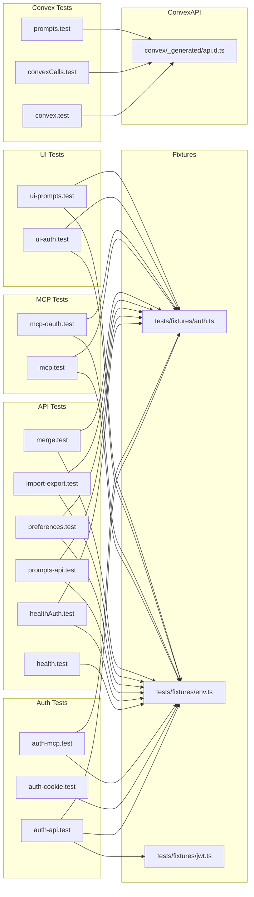
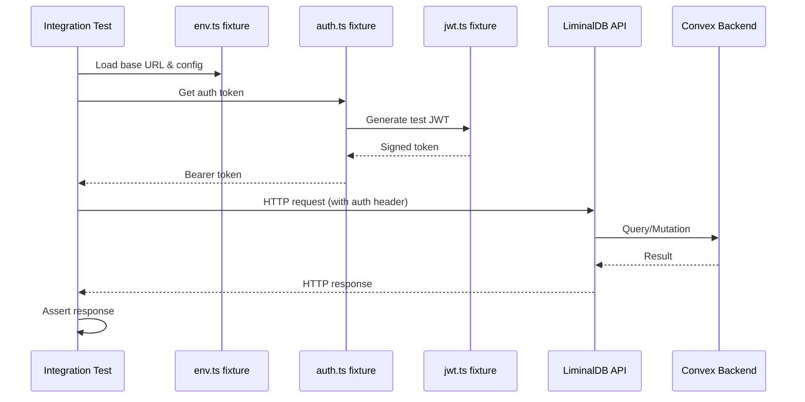

# Integration Tests

## Overview

End-to-end integration test suite covering API endpoints, authentication flows (JWT, cookie, MCP OAuth), Convex backend calls, import/export, merge operations, user preferences, and UI interactions. All tests rely on shared fixtures for environment configuration and authentication helpers.

## Responsibilities

- Validate API authentication via JWT tokens, cookies, and MCP bearer tokens
- Test Convex backend queries and mutations (prompts CRUD, convex calls)
- Verify health and authenticated health endpoints
- Test MCP protocol endpoints and OAuth 2.0 authorization flows
- Validate prompt import/export and merge operations
- Test user preferences API
- Exercise UI authentication and prompt management flows

## Structure Diagram

## Entity Table

| Name | Kind | Role | Public Entrypoints | Depends On | Used By |
| --- | --- | --- | --- | --- | --- |
| auth-api.test.ts | file | Tests API auth with JWT tokens | none | tests/fixtures/auth.ts, tests/fixtures/env.ts, tests/fixtures/jwt.ts | none |
| auth-cookie.test.ts | file | Tests cookie-based authentication flow | none | tests/fixtures/env.ts | none |
| auth-mcp.test.ts | file | Tests MCP bearer token authentication | none | tests/fixtures/auth.ts, tests/fixtures/env.ts | none |
| convex.test.ts | file | Basic Convex connectivity test | none | convex/_generated/api.d.ts | none |
| convexCalls.test.ts | file | Tests Convex query/mutation calls | none | convex/_generated/api.d.ts | none |
| prompts.test.ts | file | Comprehensive Convex prompts CRUD tests | none | convex/_generated/api.d.ts | none |
| health.test.ts | file | Tests unauthenticated health endpoint | none | tests/fixtures/env.ts | none |
| healthAuth.test.ts | file | Tests authenticated health endpoint | none | tests/fixtures/auth.ts, tests/fixtures/env.ts | none |
| import-export.test.ts | file | Tests prompt import/export workflows | none | tests/fixtures/auth.ts, tests/fixtures/env.ts | none |
| mcp-oauth.test.ts | file | Tests MCP OAuth 2.0 authorization flow | none | tests/fixtures/auth.ts, tests/fixtures/env.ts | none |
| mcp.test.ts | file | Tests MCP protocol endpoints | none | tests/fixtures/auth.ts, tests/fixtures/env.ts | none |
| merge.test.ts | file | Tests prompt merge operations | none | tests/fixtures/auth.ts, tests/fixtures/env.ts | none |
| preferences.test.ts | file | Tests user preferences API | none | tests/fixtures/auth.ts, tests/fixtures/env.ts | none |
| prompts-api.test.ts | file | Tests REST prompts API endpoints | none | tests/fixtures/auth.ts, tests/fixtures/env.ts | none |
| ui-auth.test.ts | file | Tests UI authentication flows | none | tests/fixtures/auth.ts, tests/fixtures/env.ts | none |
| ui-prompts.test.ts | file | Tests UI prompt management interactions | none | tests/fixtures/auth.ts, tests/fixtures/env.ts | none |

## Key Flow

## Flow Notes

| Step | Actor/Component | Action | Output / Side Effect |
| --- | --- | --- | --- |
| 1 | Integration Test | Loads environment configuration (base URL, secrets) from env.ts fixture | Environment config available |
| 2 | Integration Test | Obtains authentication credentials via auth.ts (and optionally jwt.ts) fixtures | Valid auth token or cookie |
| 3 | Integration Test | Sends HTTP request to LiminalDB API with auth credentials | API request dispatched |
| 4 | LiminalDB API | Validates auth, executes business logic, calls Convex backend as needed | HTTP response with data or error |
| 5 | Integration Test | Asserts response status, headers, and body against expected values | Test pass or failure |

## Source Coverage

- tests/integration/auth-api.test.ts
- tests/integration/auth-cookie.test.ts
- tests/integration/auth-mcp.test.ts
- tests/integration/convex.test.ts
- tests/integration/convex/convexCalls.test.ts
- tests/integration/convex/prompts.test.ts
- tests/integration/health.test.ts
- tests/integration/healthAuth.test.ts
- tests/integration/import-export.test.ts
- tests/integration/mcp-oauth.test.ts
- tests/integration/mcp.test.ts
- tests/integration/merge.test.ts
- tests/integration/preferences.test.ts
- tests/integration/prompts-api.test.ts
- tests/integration/ui/ui-auth.test.ts
- tests/integration/ui/ui-prompts.test.ts

## Cross-Module Context

- tests/integration/auth-api.test.ts -> tests/fixtures/auth.ts (usage)
- tests/integration/auth-api.test.ts -> tests/fixtures/env.ts (usage)
- tests/integration/auth-api.test.ts -> tests/fixtures/jwt.ts (usage)
- tests/integration/auth-cookie.test.ts -> tests/fixtures/env.ts (usage)
- tests/integration/auth-mcp.test.ts -> tests/fixtures/auth.ts (usage)
- tests/integration/auth-mcp.test.ts -> tests/fixtures/env.ts (usage)
- tests/integration/convex.test.ts -> convex/_generated/api.d.ts (usage)
- tests/integration/convex/convexCalls.test.ts -> convex/_generated/api.d.ts (usage)
- tests/integration/convex/prompts.test.ts -> convex/_generated/api.d.ts (usage)
- tests/integration/health.test.ts -> tests/fixtures/env.ts (usage)
- tests/integration/healthAuth.test.ts -> tests/fixtures/auth.ts (usage)
- tests/integration/healthAuth.test.ts -> tests/fixtures/env.ts (usage)
- tests/integration/import-export.test.ts -> tests/fixtures/auth.ts (usage)
- tests/integration/import-export.test.ts -> tests/fixtures/env.ts (usage)
- tests/integration/mcp-oauth.test.ts -> tests/fixtures/auth.ts (usage)
- tests/integration/mcp-oauth.test.ts -> tests/fixtures/env.ts (usage)
- tests/integration/mcp.test.ts -> tests/fixtures/auth.ts (usage)
- tests/integration/mcp.test.ts -> tests/fixtures/env.ts (usage)
- tests/integration/merge.test.ts -> tests/fixtures/auth.ts (usage)
- tests/integration/merge.test.ts -> tests/fixtures/env.ts (usage)
- tests/integration/preferences.test.ts -> tests/fixtures/auth.ts (usage)
- tests/integration/preferences.test.ts -> tests/fixtures/env.ts (usage)
- tests/integration/prompts-api.test.ts -> tests/fixtures/auth.ts (usage)
- tests/integration/prompts-api.test.ts -> tests/fixtures/env.ts (usage)
- tests/integration/ui/ui-auth.test.ts -> tests/fixtures/auth.ts (usage)
- tests/integration/ui/ui-auth.test.ts -> tests/fixtures/env.ts (usage)
- tests/integration/ui/ui-prompts.test.ts -> tests/fixtures/auth.ts (usage)
- tests/integration/ui/ui-prompts.test.ts -> tests/fixtures/env.ts (usage)
