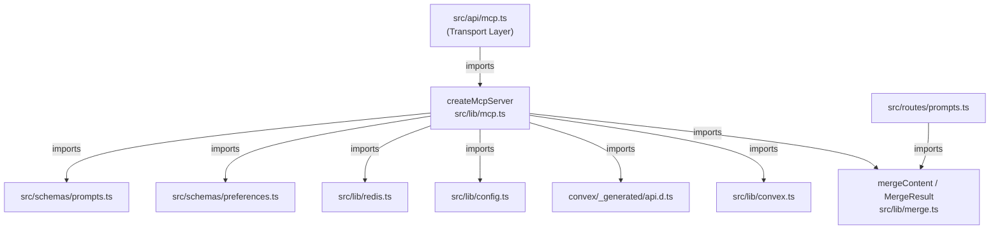
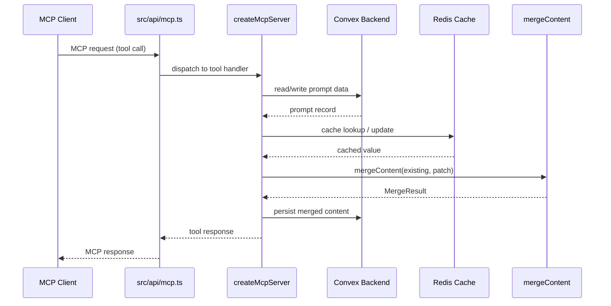

# MCP Server

## Overview

The MCP Server module implements LiminalDB's Model Context Protocol server. The core `createMcpServer` factory function (1228 LOC) wires together tool definitions, resource handlers, and all backing services (Convex, Redis, config, schemas). A companion `merge.ts` utility provides content-merge logic used both by MCP tool handlers and the REST prompts route.

## Responsibilities

- Create and configure the MCP server instance with tool definitions and resource handlers
- Coordinate access to Convex (persistence), Redis (caching), config, and validation schemas
- Provide content merging via `mergeContent` for prompt update operations
- Expose a single factory entrypoint consumed by the API transport layer

## Structure Diagram

## Entity Table

| Name | Kind | Role | Public Entrypoints | Depends On | Used By |
| --- | --- | --- | --- | --- | --- |
| createMcpServer | function | Factory that builds the MCP server, registering tools & resource handlers | src/lib/mcp.ts:createMcpServer | convex/_generated/api.d.ts, src/lib/config.ts, src/lib/convex.ts, src/lib/merge.ts, src/lib/redis.ts, src/schemas/preferences.ts, src/schemas/prompts.ts | src/api/mcp.ts, tests/service/mcp/toolHandlers.test.ts |
| mergeContent | function | Merges incoming content patches with existing content, returning a MergeResult | src/lib/merge.ts:mergeContent | none | src/lib/mcp.ts, src/routes/prompts.ts, tests/service/lib/merge.test.ts |
| MergeResult | interface | Typed shape describing the outcome of a content merge operation | src/lib/merge.ts:MergeResult | none | src/lib/mcp.ts, src/routes/prompts.ts, tests/service/lib/merge.test.ts |

## Key Flow

## Flow Notes

| Step | Actor/Component | Action | Output / Side Effect |
| --- | --- | --- | --- |
| 1 | MCP Client | Sends an MCP tool-call request to the transport endpoint | Raw MCP request arrives at src/api/mcp.ts |
| 2 | src/api/mcp.ts | Imports and invokes createMcpServer, dispatching to the matching tool handler | Tool handler receives parsed arguments |
| 3 | createMcpServer | Reads or writes data via Convex client and optionally checks Redis cache | Prompt record and cache state retrieved |
| 4 | createMcpServer | Calls mergeContent when an update involves content patching | MergeResult with merged content and conflict info |
| 5 | createMcpServer | Persists the merged content back to Convex and updates Redis cache | MCP tool response returned to transport layer |

## Source Coverage

- src/lib/mcp.ts
- src/lib/merge.ts

## Cross-Module Context

- src/api/mcp.ts -> src/lib/mcp.ts (import)
- src/lib/mcp.ts -> convex/_generated/api.d.ts (import)
- src/lib/mcp.ts -> src/lib/config.ts (import)
- src/lib/mcp.ts -> src/lib/convex.ts (import)
- src/lib/mcp.ts -> src/lib/redis.ts (import)
- src/lib/mcp.ts -> src/schemas/preferences.ts (import)
- src/lib/mcp.ts -> src/schemas/prompts.ts (import)
- src/routes/prompts.ts -> src/lib/merge.ts (import)
- tests/service/lib/merge.test.ts -> src/lib/merge.ts (usage)
- tests/service/mcp/toolHandlers.test.ts -> src/lib/mcp.ts (usage)
