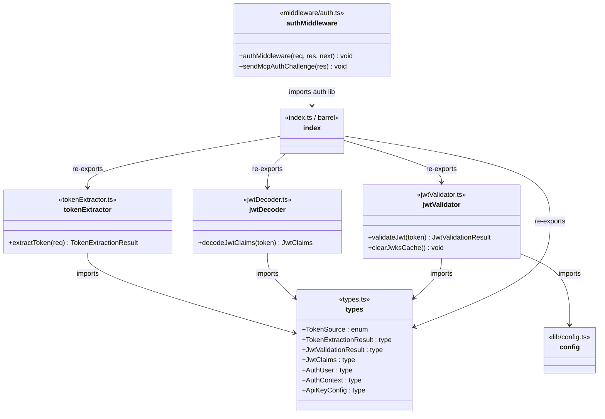
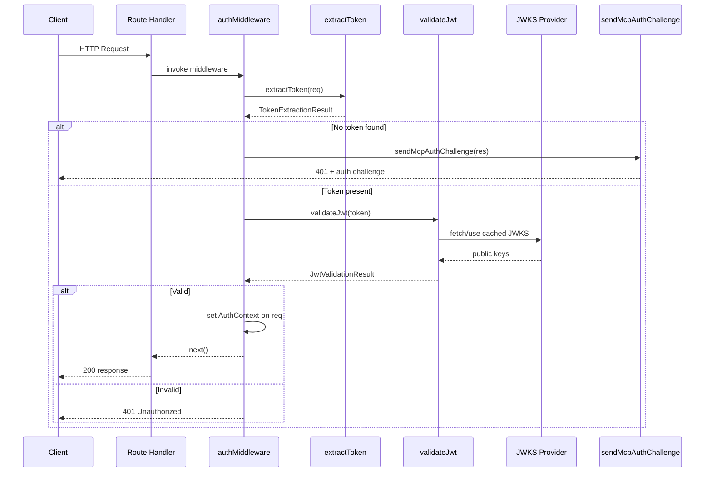

# Server Authentication

## Overview

The Server Authentication module provides JWT-based authentication for the LiminalDB HTTP service layer. It is organized as a layered pipeline: token extraction from incoming requests, JWT decoding and cryptographic validation (via JWKS), and an Express-style auth middleware that gates access to all API routes. The module also supports MCP (Model Context Protocol) auth challenges for machine-client scenarios. All auth types are centralized in a shared `types.ts` file, and the barrel `index.ts` re-exports the full public surface.

## Responsibilities

- Extract bearer tokens from HTTP request headers (Authorization header and other sources)
- Decode JWT claims without verification for inspection purposes
- Validate JWTs cryptographically using JWKS with caching (and cache-clearing support)
- Define shared auth types: TokenSource, TokenExtractionResult, JwtValidationResult, JwtClaims, AuthUser, AuthContext, ApiKeyConfig
- Provide Express auth middleware that authenticates requests and populates auth context
- Send MCP-compliant auth challenge responses for unauthenticated machine clients

## Structure Diagram

## Entity Table

| Name | Kind | Role | Public Entrypoints | Depends On | Used By |
| --- | --- | --- | --- | --- | --- |
| types.ts | type-definitions | Defines all shared auth types and enums (TokenSource, TokenExtractionResult, JwtValidationResult, JwtClaims, AuthUser, AuthContext, ApiKeyConfig) | TokenSource, TokenExtractionResult, JwtValidationResult, JwtClaims, AuthUser, AuthContext, ApiKeyConfig | none | tokenExtractor, jwtDecoder, jwtValidator, index.ts |
| extractToken | function | Extracts bearer token from incoming HTTP request, returning a TokenExtractionResult with the token and its source | extractToken | types.ts | index.ts, src/index.ts, tests (20+ test files) |
| decodeJwtClaims | function | Decodes JWT payload claims without cryptographic verification | decodeJwtClaims | types.ts | index.ts |
| validateJwt | function | Validates a JWT cryptographically using JWKS fetched from the configured provider, with result caching | validateJwt | types.ts, config.ts | index.ts |
| clearJwksCache | function | Clears the cached JWKS key set, forcing re-fetch on next validation | clearJwksCache | types.ts, config.ts | index.ts |
| index.ts (barrel) | file | Barrel re-export for the auth library — aggregates all auth functions and types into a single import path | src/lib/auth/index.ts | tokenExtractor, jwtDecoder, jwtValidator, types.ts | authMiddleware, src/api/mcp.ts |
| authMiddleware | function | Express middleware that extracts token, validates JWT, and populates AuthContext on the request — rejects unauthenticated requests | authMiddleware | index.ts (barrel) | src/api/health.ts, src/api/mcp.ts, src/routes/*, src/index.ts |
| sendMcpAuthChallenge | function | Sends an MCP-compliant authentication challenge response for machine clients that lack valid credentials | sendMcpAuthChallenge | index.ts (barrel) | src/api/mcp.ts, src/routes/* |

## Key Flow

## Flow Notes

| Step | Actor/Component | Action | Output / Side Effect |
| --- | --- | --- | --- |
| 1 | Client | Sends HTTP request with Authorization header (Bearer token) to an API route | Raw HTTP request reaches route handler |
| 2 | authMiddleware | Invokes extractToken to parse the bearer token from the request headers | TokenExtractionResult with token string and TokenSource |
| 3 | authMiddleware | If no token is found, delegates to sendMcpAuthChallenge to return a 401 with an MCP-compliant challenge | 401 response with auth challenge headers (MCP flow) or plain 401 |
| 4 | authMiddleware | If token is present, calls validateJwt which verifies the JWT signature against JWKS keys (cached or freshly fetched) | JwtValidationResult indicating success with AuthUser or failure with error |
| 5 | authMiddleware | On successful validation, populates AuthContext on the request object and calls next() | Downstream route handler receives authenticated request with user context |

## Source Coverage

- src/lib/auth/index.ts
- src/lib/auth/jwtDecoder.ts
- src/lib/auth/jwtValidator.ts
- src/lib/auth/tokenExtractor.ts
- src/lib/auth/types.ts
- src/middleware/auth.ts

## Cross-Module Context

- src/api/health.ts -> src/middleware/auth.ts (import)
- src/api/mcp.ts -> src/lib/auth/index.ts (import)
- src/api/mcp.ts -> src/middleware/auth.ts (import)
- src/index.ts -> src/lib/auth/tokenExtractor.ts (usage)
- src/index.ts -> src/middleware/auth.ts (usage)
- src/lib/auth/jwtValidator.ts -> src/lib/config.ts (import)
- src/routes/app.ts -> src/middleware/auth.ts (import)
- src/routes/auth.ts -> src/middleware/auth.ts (import)
- src/routes/drafts.ts -> src/middleware/auth.ts (import)
- src/routes/import-export.ts -> src/middleware/auth.ts (import)
- src/routes/preferences.ts -> src/middleware/auth.ts (import)
- src/routes/prompts.ts -> src/middleware/auth.ts (import)
- tests/service/auth/mcp.test.ts -> src/lib/auth/tokenExtractor.ts (usage)
- tests/service/auth/mcp.test.ts -> src/middleware/auth.ts (usage)
- tests/service/auth/middleware.test.ts -> src/lib/auth/index.ts (usage)
- tests/service/auth/middleware.test.ts -> src/lib/auth/tokenExtractor.ts (usage)
- tests/service/auth/middleware.test.ts -> src/middleware/auth.ts (usage)
- tests/service/auth/routes.test.ts -> src/lib/auth/tokenExtractor.ts (usage)
- tests/service/auth/routes.test.ts -> src/middleware/auth.ts (usage)
- tests/service/drafts/drafts.test.ts -> src/lib/auth/tokenExtractor.ts (usage)
- tests/service/drafts/drafts.test.ts -> src/middleware/auth.ts (usage)
- tests/service/mcp/auth-challenge.test.ts -> src/lib/auth/tokenExtractor.ts (usage)
- tests/service/mcp/auth-challenge.test.ts -> src/middleware/auth.ts (usage)
- tests/service/mcp/resources.test.ts -> src/lib/auth/tokenExtractor.ts (usage)
- tests/service/mcp/resources.test.ts -> src/middleware/auth.ts (usage)
- tests/service/mcp/tools.test.ts -> src/lib/auth/tokenExtractor.ts (usage)
- tests/service/mcp/tools.test.ts -> src/middleware/auth.ts (usage)
- tests/service/mcp/well-known.test.ts -> src/lib/auth/tokenExtractor.ts (usage)
- tests/service/mcp/well-known.test.ts -> src/middleware/auth.ts (usage)
- tests/service/preferences.test.ts -> src/lib/auth/tokenExtractor.ts (usage)
- tests/service/preferences.test.ts -> src/middleware/auth.ts (usage)
- tests/service/prompts/createPrompts.test.ts -> src/lib/auth/tokenExtractor.ts (usage)
- tests/service/prompts/createPrompts.test.ts -> src/middleware/auth.ts (usage)
- tests/service/prompts/deletePrompt.test.ts -> src/lib/auth/tokenExtractor.ts (usage)
- tests/service/prompts/deletePrompt.test.ts -> src/middleware/auth.ts (usage)
- tests/service/prompts/edgeCases.test.ts -> src/lib/auth/tokenExtractor.ts (usage)
- tests/service/prompts/edgeCases.test.ts -> src/middleware/auth.ts (usage)
- tests/service/prompts/flagsUsage.test.ts -> src/lib/auth/tokenExtractor.ts (usage)
- tests/service/prompts/flagsUsage.test.ts -> src/middleware/auth.ts (usage)
- tests/service/prompts/getPrompt.test.ts -> src/lib/auth/tokenExtractor.ts (usage)
- tests/service/prompts/getPrompt.test.ts -> src/middleware/auth.ts (usage)
- tests/service/prompts/importExport.test.ts -> src/lib/auth/tokenExtractor.ts (usage)
- tests/service/prompts/importExport.test.ts -> src/middleware/auth.ts (usage)
- tests/service/prompts/listPrompts.test.ts -> src/lib/auth/tokenExtractor.ts (usage)
- tests/service/prompts/listPrompts.test.ts -> src/middleware/auth.ts (usage)
- tests/service/prompts/mcpTools.test.ts -> src/lib/auth/tokenExtractor.ts (usage)
- tests/service/prompts/mcpTools.test.ts -> src/middleware/auth.ts (usage)
- tests/service/prompts/mergePrompt.test.ts -> src/lib/auth/tokenExtractor.ts (usage)
- tests/service/prompts/mergePrompt.test.ts -> src/middleware/auth.ts (usage)
- tests/service/prompts/updatePrompt.test.ts -> src/lib/auth/tokenExtractor.ts (usage)
- tests/service/prompts/updatePrompt.test.ts -> src/middleware/auth.ts (usage)
