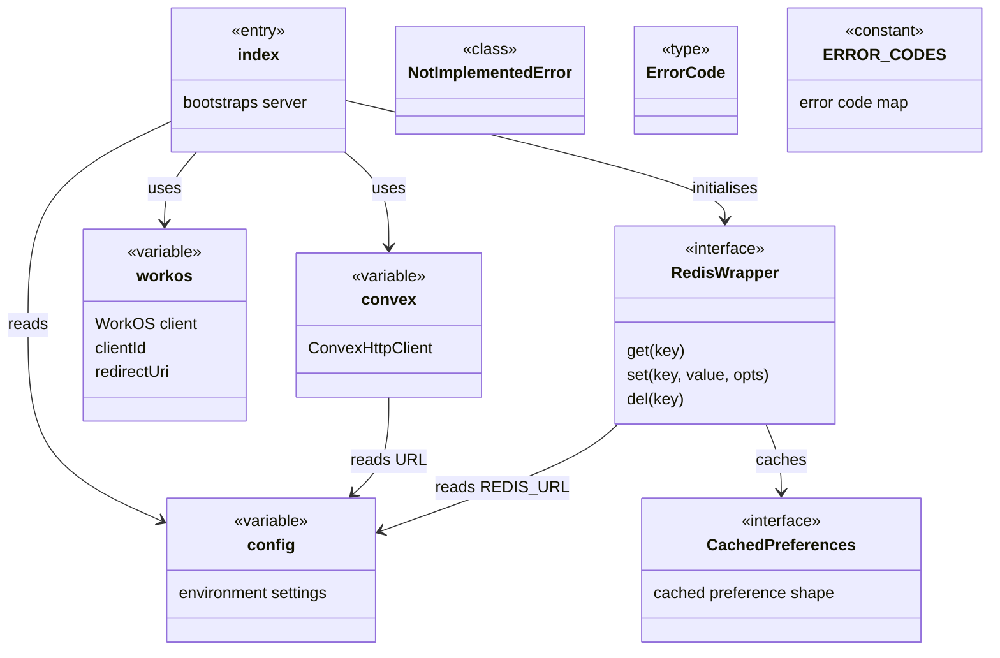
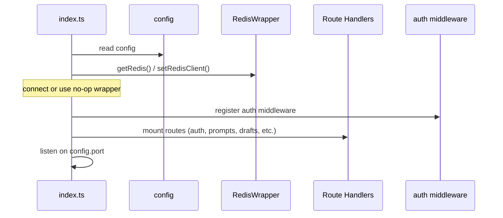

# Server Entry & Configuration

## Overview

Core bootstrap module for the LiminalDB server. It contains the application entry point (`src/index.ts`) which wires together configuration, external service clients (Convex, WorkOS, Redis), middleware, and route handlers. Supporting library files expose singleton clients and helpers consumed across the entire codebase.

## Responsibilities

- Application startup, middleware registration, and route mounting
- Centralised environment-driven configuration via `config`
- Convex backend client initialisation
- WorkOS authentication client and redirect URI setup
- Redis connection management with a swappable `RedisWrapper` interface and preference caching layer
- Standardised error codes for API responses

## Structure Diagram

## Entity Table

| Name | Kind | Role | Public Entrypoints | Depends On | Used By |
| --- | --- | --- | --- | --- | --- |
| src/index.ts | file | Application entry point — creates the HTTP server, registers middleware and mounts all route/API handlers | src/index.ts | config, RedisWrapper, convex, workos | none |
| config | variable | Reads environment variables and exposes a typed configuration object used throughout the app | src/lib/config.ts:config | none | src/index.ts, src/api/health.ts, src/api/mcp.ts, src/lib/auth/jwtValidator.ts, src/lib/mcp.ts, src/lib/redis.ts, src/routes/import-export.ts, src/routes/preferences.ts, src/routes/prompts.ts |
| convex | variable | Singleton ConvexHttpClient used for backend data operations | src/lib/convex.ts:convex | none | src/api/health.ts, src/lib/mcp.ts, src/routes/import-export.ts, src/routes/preferences.ts, src/routes/prompts.ts |
| workos | variable | WorkOS SDK client for authentication flows | src/lib/workos.ts:workos, src/lib/workos.ts:clientId, src/lib/workos.ts:redirectUri | none | src/routes/auth.ts |
| RedisWrapper | interface | Abstraction over Redis client enabling test mocking and feature-flagged disabling | src/lib/redis.ts:RedisWrapper, src/lib/redis.ts:getRedis, src/lib/redis.ts:setRedisClient | config | src/index.ts, src/lib/mcp.ts, src/routes/drafts.ts, src/routes/preferences.ts, tests/__mocks__/redis.ts |
| CachedPreferences | interface | Shape for cached user preferences stored in Redis | src/lib/redis.ts:CachedPreferences, src/lib/redis.ts:getCachedPreferences, src/lib/redis.ts:setCachedPreferences, src/lib/redis.ts:invalidateCachedPreferences | RedisWrapper, src/schemas/preferences.ts | src/routes/preferences.ts, src/lib/mcp.ts, src/routes/drafts.ts |
| NotImplementedError | class | Error thrown when Redis operations are called on a no-op wrapper | src/lib/redis.ts:NotImplementedError | none | none |
| ERROR_CODES | constant | Map of standardised machine-readable error codes for API responses | src/lib/errors.ts:ERROR_CODES | none | none |
| ErrorCode | type | Union type derived from ERROR_CODES keys | src/lib/errors.ts:ErrorCode | none | none |

## Key Flow

## Flow Notes

| Step | Actor/Component | Action | Output / Side Effect |
| --- | --- | --- | --- |
| 1 | index.ts | Imports and reads the typed config object from environment variables | config object available |
| 2 | index.ts | Initialises Redis connection via getRedis(); falls back to no-op RedisWrapper if REDIS_URL is absent | RedisWrapper instance set |
| 3 | index.ts | Registers token extractor and auth middleware on the Express/Hono app | Middleware chain ready |
| 4 | index.ts | Mounts route handlers (auth, prompts, drafts, modules, preferences, import-export, well-known) and API endpoints (health, mcp) | All routes available |
| 5 | index.ts | Starts HTTP server on the configured port | Server listening |

## Source Coverage

- src/index.ts
- src/lib/config.ts
- src/lib/convex.ts
- src/lib/errors.ts
- src/lib/redis.ts
- src/lib/workos.ts

## Cross-Module Context

- src/api/health.ts -> src/lib/config.ts (import)
- src/api/health.ts -> src/lib/convex.ts (import)
- src/api/mcp.ts -> src/lib/config.ts (import)
- src/index.ts -> src/api/health.ts (usage)
- src/index.ts -> src/api/mcp.ts (usage)
- src/index.ts -> src/lib/auth/tokenExtractor.ts (usage)
- src/index.ts -> src/middleware/auth.ts (usage)
- src/index.ts -> src/routes/app.ts (usage)
- src/index.ts -> src/routes/auth.ts (usage)
- src/index.ts -> src/routes/drafts.ts (usage)
- src/index.ts -> src/routes/import-export.ts (usage)
- src/index.ts -> src/routes/modules.ts (usage)
- src/index.ts -> src/routes/preferences.ts (usage)
- src/index.ts -> src/routes/prompts.ts (usage)
- src/index.ts -> src/routes/well-known.ts (usage)
- src/lib/auth/jwtValidator.ts -> src/lib/config.ts (import)
- src/lib/mcp.ts -> src/lib/config.ts (import)
- src/lib/mcp.ts -> src/lib/convex.ts (import)
- src/lib/mcp.ts -> src/lib/redis.ts (import)
- src/lib/redis.ts -> src/schemas/preferences.ts (import)
- src/routes/auth.ts -> src/lib/workos.ts (import)
- src/routes/drafts.ts -> src/lib/redis.ts (import)
- src/routes/import-export.ts -> src/lib/config.ts (import)
- src/routes/import-export.ts -> src/lib/convex.ts (import)
- src/routes/preferences.ts -> src/lib/config.ts (import)
- src/routes/preferences.ts -> src/lib/convex.ts (import)
- src/routes/preferences.ts -> src/lib/redis.ts (import)
- src/routes/prompts.ts -> src/lib/config.ts (import)
- src/routes/prompts.ts -> src/lib/convex.ts (import)
- tests/__mocks__/redis.ts -> src/lib/redis.ts (import)
- tests/service/drafts/drafts.test.ts -> src/lib/redis.ts (usage)
