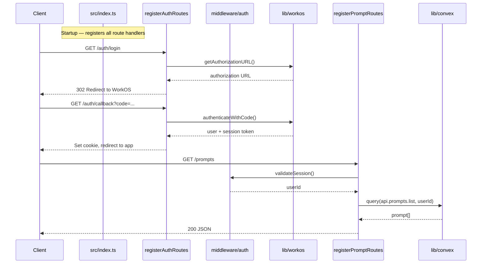

# Server Routes

## Overview

The Server Routes module contains all HTTP route handlers for the LiminalDB web application. Each route file exports a single registration function that mounts endpoints onto the server. Routes span the full application surface: authentication (WorkOS-based), prompt CRUD operations, draft management (Redis-backed), user preferences, bulk import/export, module listing, MCP protocol endpoints, health checks, and OAuth/.well-known discovery. All route registrars follow a consistent pattern and are wired together by `src/index.ts` at startup.

## Responsibilities

- Register authentication routes (login, callback, logout) using WorkOS integration
- Provide full CRUD operations for prompts via Convex backend with schema validation
- Manage ephemeral draft state backed by Redis
- Handle user preference storage and retrieval through Convex with Redis caching
- Support bulk import and export of prompts with format validation
- Expose module listing endpoints
- Serve MCP (Model Context Protocol) transport endpoints with auth challenge support
- Provide health check endpoints with Convex connectivity verification
- Serve .well-known discovery documents for OAuth/MCP metadata

## Structure Diagram

```mermaid
flowchart TD
  index["src/index.ts"]
  index --> app["registerAppRoutes"]
  index --> auth["registerAuthRoutes"]
  index --> prompts["registerPromptRoutes"]
  index --> drafts["registerDraftRoutes"]
  index --> prefs["registerPreferencesRoutes"]
  index --> impexp["registerImportExportRoutes"]
  index --> modules["registerModuleRoutes"]
  index --> wellknown["registerWellKnownRoutes"]
  index --> health["registerHealthRoutes"]
  index --> mcp["registerMcpRoutes"]

  auth --> workos["lib/workos"]
  auth --> authMw["middleware/auth"]
  app --> authMw
  prompts --> authMw
  prompts --> convex["lib/convex"]
  prompts --> merge["lib/merge"]
  prompts --> promptSchema["schemas/prompts"]
  drafts --> authMw
  drafts --> redis["lib/redis"]
  drafts --> draftSchema["schemas/drafts"]
  prefs --> authMw
  prefs --> convex
  prefs --> redis
  prefs --> prefSchema["schemas/preferences"]
  impexp --> authMw
  impexp --> convex
  impexp --> impexpSchema["schemas/import-export"]
  modules --> prefSchema
  health --> authMw
  health --> convex
  mcp --> authMw
  mcp --> mcpLib["lib/mcp"]
  mcp --> authLib["lib/auth"]
```

## Entity Table

| Name | Kind | Role | Public Entrypoints | Depends On | Used By |
| --- | --- | --- | --- | --- | --- |
| registerAppRoutes | function | Mounts top-level app page routes with auth gating | registerAppRoutes | middleware/auth, schemas/preferences | src/index.ts |
| registerAuthRoutes | function | Handles login, OAuth callback, and logout flows via WorkOS | registerAuthRoutes | lib/workos, middleware/auth | src/index.ts |
| registerPromptRoutes | function | Full CRUD for prompts — list, get, create, update, delete — with merge support | registerPromptRoutes | convex/_generated/api, lib/config, lib/convex, lib/merge, middleware/auth, schemas/prompts | src/index.ts |
| registerDraftRoutes | function | Manages ephemeral prompt drafts stored in Redis | registerDraftRoutes | lib/redis, middleware/auth, schemas/drafts | src/index.ts |
| registerPreferencesRoutes | function | Reads and writes user preferences via Convex with Redis cache layer | registerPreferencesRoutes | convex/_generated/api, lib/config, lib/convex, lib/redis, middleware/auth, schemas/preferences | src/index.ts |
| registerImportExportRoutes | function | Bulk import and export of prompts with schema validation | registerImportExportRoutes | convex/_generated/api, lib/config, lib/convex, middleware/auth, schemas/import-export, schemas/prompts | src/index.ts |
| registerModuleRoutes | function | Lists available modules/plugins using preferences schema | registerModuleRoutes | schemas/preferences | src/index.ts |
| registerWellKnownRoutes | function | Serves .well-known discovery documents for OAuth and MCP metadata | registerWellKnownRoutes | none | src/index.ts |
| registerHealthRoutes | function | Health check endpoint verifying server and Convex connectivity | registerHealthRoutes | convex/_generated/api, lib/config, lib/convex, middleware/auth | src/index.ts |
| registerMcpRoutes | function | MCP protocol transport endpoints with authenticated sessions | registerMcpRoutes, buildAuthInfo | lib/auth, lib/config, lib/mcp, middleware/auth | src/index.ts |
| McpTransport | interface | Defines the MCP transport contract for streaming protocol messages | McpTransport | none | registerMcpRoutes |
| McpDependencies | interface | Dependency injection interface for MCP route configuration | McpDependencies | none | registerMcpRoutes |

## Key Flow

## Flow Notes

| Step | Actor/Component | Action | Output / Side Effect |
| --- | --- | --- | --- |
| 1 | src/index.ts | Calls each register*Routes function to mount all HTTP endpoints on the server | Server fully configured with all route handlers |
| 2 | Client | Initiates login via /auth/login; registerAuthRoutes delegates to WorkOS for OAuth | 302 redirect to WorkOS authorization URL |
| 3 | WorkOS | Completes OAuth flow and redirects to /auth/callback with authorization code | Session token and user identity returned |
| 4 | Client | Makes authenticated request to a protected route (e.g., GET /prompts) | Request includes session cookie |
| 5 | middleware/auth | Validates session token and extracts userId for the route handler | Authenticated context passed to route |
| 6 | Route handler | Queries or mutates Convex backend (or Redis for drafts/cache) based on validated request | JSON response returned to client |

## Source Coverage

- src/api/health.ts
- src/api/mcp.ts
- src/routes/app.ts
- src/routes/auth.ts
- src/routes/drafts.ts
- src/routes/import-export.ts
- src/routes/modules.ts
- src/routes/preferences.ts
- src/routes/prompts.ts
- src/routes/well-known.ts

## Cross-Module Context

- src/api/health.ts -> convex/_generated/api.d.ts (import)
- src/api/health.ts -> src/lib/config.ts (import)
- src/api/health.ts -> src/lib/convex.ts (import)
- src/api/health.ts -> src/middleware/auth.ts (import)
- src/api/mcp.ts -> src/lib/auth/index.ts (import)
- src/api/mcp.ts -> src/lib/config.ts (import)
- src/api/mcp.ts -> src/lib/mcp.ts (import)
- src/api/mcp.ts -> src/middleware/auth.ts (import)
- src/index.ts -> src/api/health.ts (usage)
- src/index.ts -> src/api/mcp.ts (usage)
- src/index.ts -> src/routes/app.ts (usage)
- src/index.ts -> src/routes/auth.ts (usage)
- src/index.ts -> src/routes/drafts.ts (usage)
- src/index.ts -> src/routes/import-export.ts (usage)
- src/index.ts -> src/routes/modules.ts (usage)
- src/index.ts -> src/routes/preferences.ts (usage)
- src/index.ts -> src/routes/prompts.ts (usage)
- src/index.ts -> src/routes/well-known.ts (usage)
- src/routes/app.ts -> src/middleware/auth.ts (import)
- src/routes/app.ts -> src/schemas/preferences.ts (import)
- src/routes/auth.ts -> src/lib/workos.ts (import)
- src/routes/auth.ts -> src/middleware/auth.ts (import)
- src/routes/drafts.ts -> src/lib/redis.ts (import)
- src/routes/drafts.ts -> src/middleware/auth.ts (import)
- src/routes/drafts.ts -> src/schemas/drafts.ts (import)
- src/routes/import-export.ts -> convex/_generated/api.d.ts (import)
- src/routes/import-export.ts -> src/lib/config.ts (import)
- src/routes/import-export.ts -> src/lib/convex.ts (import)
- src/routes/import-export.ts -> src/middleware/auth.ts (import)
- src/routes/import-export.ts -> src/schemas/import-export.ts (import)
- src/routes/import-export.ts -> src/schemas/prompts.ts (import)
- src/routes/modules.ts -> src/schemas/preferences.ts (import)
- src/routes/preferences.ts -> convex/_generated/api.d.ts (import)
- src/routes/preferences.ts -> src/lib/config.ts (import)
- src/routes/preferences.ts -> src/lib/convex.ts (import)
- src/routes/preferences.ts -> src/lib/redis.ts (import)
- src/routes/preferences.ts -> src/middleware/auth.ts (import)
- src/routes/preferences.ts -> src/schemas/preferences.ts (import)
- src/routes/prompts.ts -> convex/_generated/api.d.ts (import)
- src/routes/prompts.ts -> src/lib/config.ts (import)
- src/routes/prompts.ts -> src/lib/convex.ts (import)
- src/routes/prompts.ts -> src/lib/merge.ts (import)
- src/routes/prompts.ts -> src/middleware/auth.ts (import)
- src/routes/prompts.ts -> src/schemas/prompts.ts (import)
- tests/service/auth/mcp.test.ts -> src/api/mcp.ts (usage)
- tests/service/auth/routes.test.ts -> src/routes/auth.ts (usage)
- tests/service/drafts/drafts.test.ts -> src/routes/drafts.ts (usage)
- tests/service/mcp/auth-challenge.test.ts -> src/api/mcp.ts (usage)
- tests/service/mcp/resources.test.ts -> src/api/mcp.ts (usage)
- tests/service/mcp/tools.test.ts -> src/api/mcp.ts (usage)
- tests/service/mcp/well-known.test.ts -> src/routes/well-known.ts (usage)
- tests/service/prompts/createPrompts.test.ts -> src/routes/prompts.ts (usage)
- tests/service/prompts/deletePrompt.test.ts -> src/routes/prompts.ts (usage)
- tests/service/prompts/edgeCases.test.ts -> src/routes/prompts.ts (usage)
- tests/service/prompts/getPrompt.test.ts -> src/routes/prompts.ts (usage)
- tests/service/prompts/importExport.test.ts -> src/routes/import-export.ts (usage)
- tests/service/prompts/mcpTools.test.ts -> src/api/mcp.ts (usage)
- tests/service/prompts/updatePrompt.test.ts -> src/routes/prompts.ts (usage)
