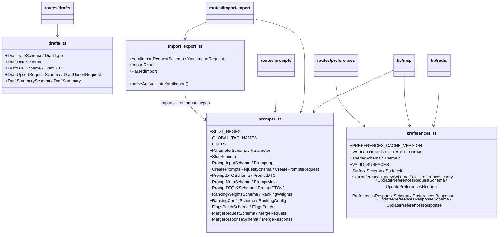
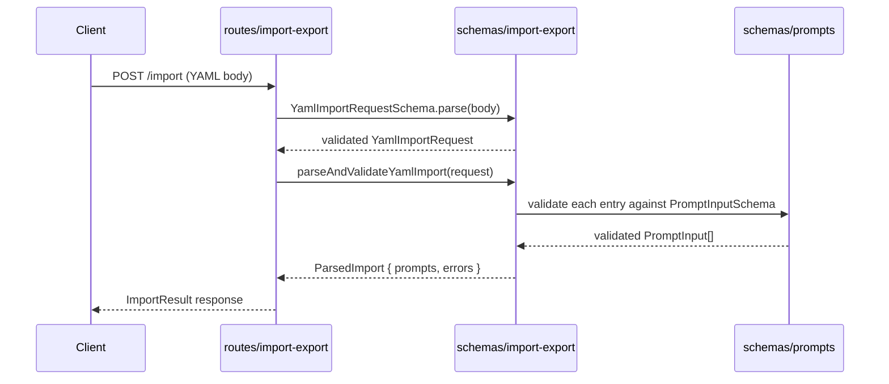

# Server Schemas

## Overview

Centralized Zod validation schemas and inferred TypeScript types for the LiminalDB server. This module defines the shape and constraints for prompts, drafts, user preferences, and YAML import/export payloads. All route handlers, the MCP integration layer, and the Redis cache layer import from these schema files to ensure consistent validation and type safety across the entire server.

## Responsibilities

- Define Zod schemas and inferred TypeScript types for prompt CRUD, merging, ranking, and flags
- Define draft type, DTO, upsert request, and summary schemas
- Define user preference schemas including theme and surface identifiers, with cache versioning
- Define YAML import/export request schemas and provide a `parseAndValidateYamlImport` validation function
- Expose domain constants such as SLUG_REGEX, LIMITS, GLOBAL_TAG_NAMES, VALID_THEMES, and VALID_SURFACES
- Serve as the single source of truth for request/response shapes consumed by routes, MCP tools, and caching

## Structure Diagram

## Entity Table

| Name | Kind | Role | Public Entrypoints | Depends On | Used By |
| --- | --- | --- | --- | --- | --- |
| prompts.ts | schema file | Defines all prompt-related Zod schemas, constants (SLUG_REGEX, LIMITS, GLOBAL_TAG_NAMES), and inferred types for parameters, prompt input/output DTOs, ranking, flags, and merge operations | src/schemas/prompts.ts | none | src/routes/prompts.ts, src/routes/import-export.ts, src/lib/mcp.ts, src/schemas/import-export.ts, tests/service/prompts/edgeCases.test.ts |
| drafts.ts | schema file | Defines draft-related schemas: DraftType, DraftData, DraftDTO, DraftUpsertRequest, and DraftSummary | src/schemas/drafts.ts | none | src/routes/drafts.ts, tests/service/drafts/drafts.test.ts |
| preferences.ts | schema file | Defines user preference schemas for themes, surfaces, query/response shapes, and cache version constant | src/schemas/preferences.ts | none | src/routes/preferences.ts, src/routes/app.ts, src/routes/modules.ts, src/lib/mcp.ts, src/lib/redis.ts |
| import-export.ts | schema file | Defines YAML import request schema, ImportResult/ParsedImport interfaces, and parseAndValidateYamlImport function | src/schemas/import-export.ts | src/schemas/prompts.ts | src/routes/import-export.ts |
| parseAndValidateYamlImport | function | Parses raw YAML import payload and validates it against PromptInput schemas, returning a ParsedImport result | src/schemas/import-export.ts:parseAndValidateYamlImport | src/schemas/prompts.ts | src/routes/import-export.ts |

## Key Flow

## Flow Notes

| Step | Actor/Component | Action | Output / Side Effect |
| --- | --- | --- | --- |
| 1 | Client | Sends a POST request with a YAML payload to the import endpoint | Raw request body |
| 2 | routes/import-export | Parses the request body using YamlImportRequestSchema | Validated YamlImportRequest object |
| 3 | routes/import-export | Calls parseAndValidateYamlImport with the validated request | Delegates to import-export schema module |
| 4 | schemas/import-export | Iterates over YAML entries and validates each against PromptInputSchema from prompts.ts | Array of validated PromptInput objects and any validation errors |
| 5 | routes/import-export | Returns ImportResult with created/failed counts to the client | JSON response with import results |

## Source Coverage

- src/schemas/drafts.ts
- src/schemas/import-export.ts
- src/schemas/preferences.ts
- src/schemas/prompts.ts

## Cross-Module Context

- src/lib/mcp.ts -> src/schemas/preferences.ts (import)
- src/lib/mcp.ts -> src/schemas/prompts.ts (import)
- src/lib/redis.ts -> src/schemas/preferences.ts (import)
- src/routes/app.ts -> src/schemas/preferences.ts (import)
- src/routes/drafts.ts -> src/schemas/drafts.ts (import)
- src/routes/import-export.ts -> src/schemas/import-export.ts (import)
- src/routes/import-export.ts -> src/schemas/prompts.ts (import)
- src/routes/modules.ts -> src/schemas/preferences.ts (import)
- src/routes/preferences.ts -> src/schemas/preferences.ts (import)
- src/routes/prompts.ts -> src/schemas/prompts.ts (import)
- tests/service/drafts/drafts.test.ts -> src/schemas/drafts.ts (usage)
- tests/service/prompts/edgeCases.test.ts -> src/schemas/prompts.ts (usage)
