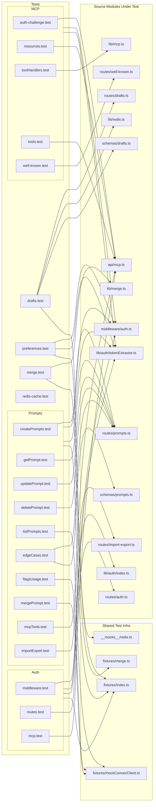
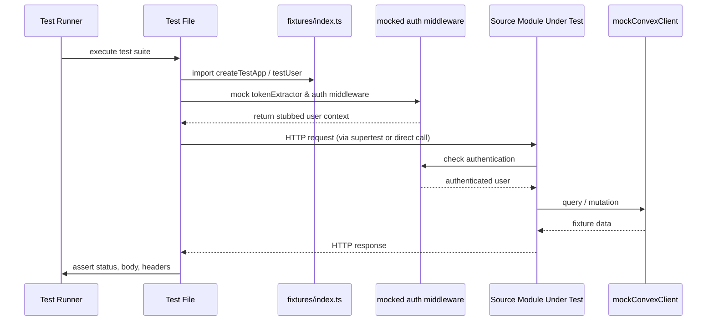

# Service Unit Tests

## Overview

Comprehensive unit test suite for the LiminalDB HTTP service layer. The 22 test files (~5,575 LOC) cover authentication middleware, prompt CRUD operations, MCP protocol endpoints, drafts, preferences, merge logic, Redis caching, and import/export. Nearly all tests share a common pattern: they mock `tokenExtractor` and `auth` middleware, use shared fixtures, and exercise source modules in isolation.

## Responsibilities

- Verify auth middleware correctly extracts tokens, validates JWTs, and rejects unauthorized requests
- Test auth routes (login/callback) and MCP-specific auth challenges
- Validate all prompt CRUD operations: create, read, update, delete, list
- Cover prompt edge cases, flags/usage tracking, and schema validation
- Test MCP tool registration, tool handler execution, resource listing, and well-known endpoint discovery
- Verify draft persistence and retrieval via Redis-backed routes
- Test three-way merge logic for concurrent prompt edits
- Validate user preferences API
- Test import/export round-trip fidelity
- Verify Redis cache behavior

## Structure Diagram

## Entity Table

| Name | Kind | Role | Public Entrypoints | Depends On | Used By |
| --- | --- | --- | --- | --- | --- |
| middleware.test.ts | test-file | Tests auth middleware token validation and request rejection | none | src/middleware/auth.ts, src/lib/auth/index.ts, src/lib/auth/tokenExtractor.ts, tests/fixtures/index.ts | none |
| routes.test.ts (auth) | test-file | Tests auth login/callback routes | none | src/routes/auth.ts, src/middleware/auth.ts, src/lib/auth/tokenExtractor.ts, tests/fixtures/index.ts | none |
| mcp.test.ts (auth) | test-file | Tests MCP-specific auth flows | none | src/api/mcp.ts, src/middleware/auth.ts, src/lib/auth/tokenExtractor.ts, tests/fixtures/index.ts | none |
| createPrompts.test.ts | test-file | Tests prompt creation API | none | src/routes/prompts.ts, src/middleware/auth.ts, src/lib/auth/tokenExtractor.ts, tests/fixtures/index.ts | none |
| getPrompt.test.ts | test-file | Tests single prompt retrieval | none | src/routes/prompts.ts, src/middleware/auth.ts, src/lib/auth/tokenExtractor.ts, tests/fixtures/index.ts | none |
| updatePrompt.test.ts | test-file | Tests prompt updates | none | src/routes/prompts.ts, src/middleware/auth.ts, src/lib/auth/tokenExtractor.ts, tests/fixtures/index.ts | none |
| deletePrompt.test.ts | test-file | Tests prompt deletion | none | src/routes/prompts.ts, src/middleware/auth.ts, src/lib/auth/tokenExtractor.ts, tests/fixtures/index.ts | none |
| listPrompts.test.ts | test-file | Tests prompt listing with pagination | none | src/middleware/auth.ts, src/lib/auth/tokenExtractor.ts, tests/fixtures/index.ts, tests/fixtures/mockConvexClient.ts | none |
| edgeCases.test.ts | test-file | Tests prompt API boundary conditions and schema validation | none | src/routes/prompts.ts, src/schemas/prompts.ts, src/middleware/auth.ts, src/lib/auth/tokenExtractor.ts, tests/fixtures/index.ts | none |
| flagsUsage.test.ts | test-file | Tests feature flags and usage tracking on prompts | none | src/middleware/auth.ts, src/lib/auth/tokenExtractor.ts, tests/fixtures/index.ts, tests/fixtures/mockConvexClient.ts | none |
| mergePrompt.test.ts | test-file | Tests prompt merge conflict resolution via API | none | src/middleware/auth.ts, src/lib/auth/tokenExtractor.ts, tests/fixtures/index.ts, tests/fixtures/mockConvexClient.ts | none |
| mcpTools.test.ts (prompts) | test-file | Tests MCP tool invocations for prompt operations | none | src/api/mcp.ts, src/middleware/auth.ts, src/lib/auth/tokenExtractor.ts, tests/fixtures/index.ts | none |
| importExport.test.ts | test-file | Tests bulk import/export round-trips | none | src/routes/import-export.ts, src/middleware/auth.ts, src/lib/auth/tokenExtractor.ts, tests/fixtures/index.ts | none |
| auth-challenge.test.ts | test-file | Tests MCP auth challenge responses | none | src/api/mcp.ts, src/middleware/auth.ts, src/lib/auth/tokenExtractor.ts | none |
| resources.test.ts | test-file | Tests MCP resource listing and retrieval | none | src/api/mcp.ts, src/middleware/auth.ts, src/lib/auth/tokenExtractor.ts, tests/fixtures/index.ts | none |
| toolHandlers.test.ts | test-file | Tests MCP tool handler logic in isolation | none | src/lib/mcp.ts | none |
| tools.test.ts | test-file | Tests MCP tool registration and discovery | none | src/api/mcp.ts, src/middleware/auth.ts, src/lib/auth/tokenExtractor.ts, tests/fixtures/index.ts | none |
| well-known.test.ts | test-file | Tests .well-known endpoint for MCP server metadata | none | src/routes/well-known.ts, src/middleware/auth.ts, src/lib/auth/tokenExtractor.ts | none |
| drafts.test.ts | test-file | Tests draft CRUD via Redis-backed routes | none | src/routes/drafts.ts, src/lib/redis.ts, src/schemas/drafts.ts, src/middleware/auth.ts, src/lib/auth/tokenExtractor.ts, tests/__mocks__/redis.ts, tests/fixtures/index.ts | none |
| preferences.test.ts | test-file | Tests user preferences API | none | src/middleware/auth.ts, src/lib/auth/tokenExtractor.ts, tests/fixtures/index.ts | none |
| merge.test.ts | test-file | Tests three-way merge algorithm directly | none | src/lib/merge.ts, tests/fixtures/merge.ts | none |
| redis-cache.test.ts | test-file | Tests Redis cache get/set/invalidation behavior | none | none | none |

## Key Flow

## Flow Notes

| Step | Actor/Component | Action | Output / Side Effect |
| --- | --- | --- | --- |
| 1 | Test Runner | Discovers and executes a test file from tests/service/ | Test suite begins |
| 2 | Test File | Imports shared fixtures and mocks tokenExtractor + auth middleware | Stubbed auth context injected into requests |
| 3 | Test File | Constructs HTTP request against the source module (route or API handler) | Request dispatched to source module |
| 4 | Source Module | Processes request through mocked middleware, calls mocked Convex/Redis | Response generated from fixture data |
| 5 | Test File | Asserts response status, body shape, headers, and side effects | Pass/fail result reported to runner |

## Source Coverage

- tests/service/auth/mcp.test.ts
- tests/service/auth/middleware.test.ts
- tests/service/auth/routes.test.ts
- tests/service/drafts/drafts.test.ts
- tests/service/lib/merge.test.ts
- tests/service/mcp/auth-challenge.test.ts
- tests/service/mcp/resources.test.ts
- tests/service/mcp/toolHandlers.test.ts
- tests/service/mcp/tools.test.ts
- tests/service/mcp/well-known.test.ts
- tests/service/preferences.test.ts
- tests/service/prompts/createPrompts.test.ts
- tests/service/prompts/deletePrompt.test.ts
- tests/service/prompts/edgeCases.test.ts
- tests/service/prompts/flagsUsage.test.ts
- tests/service/prompts/getPrompt.test.ts
- tests/service/prompts/importExport.test.ts
- tests/service/prompts/listPrompts.test.ts
- tests/service/prompts/mcpTools.test.ts
- tests/service/prompts/mergePrompt.test.ts
- tests/service/prompts/updatePrompt.test.ts
- tests/service/redis-cache.test.ts

## Cross-Module Context

- tests/service/auth/mcp.test.ts -> src/api/mcp.ts (usage)
- tests/service/auth/mcp.test.ts -> src/lib/auth/tokenExtractor.ts (usage)
- tests/service/auth/mcp.test.ts -> src/middleware/auth.ts (usage)
- tests/service/auth/mcp.test.ts -> tests/fixtures/index.ts (usage)
- tests/service/auth/middleware.test.ts -> src/lib/auth/index.ts (usage)
- tests/service/auth/middleware.test.ts -> src/lib/auth/tokenExtractor.ts (usage)
- tests/service/auth/middleware.test.ts -> src/middleware/auth.ts (usage)
- tests/service/auth/middleware.test.ts -> tests/fixtures/index.ts (usage)
- tests/service/auth/routes.test.ts -> src/lib/auth/tokenExtractor.ts (usage)
- tests/service/auth/routes.test.ts -> src/middleware/auth.ts (usage)
- tests/service/auth/routes.test.ts -> src/routes/auth.ts (usage)
- tests/service/auth/routes.test.ts -> tests/fixtures/index.ts (usage)
- tests/service/drafts/drafts.test.ts -> src/lib/auth/tokenExtractor.ts (usage)
- tests/service/drafts/drafts.test.ts -> src/lib/redis.ts (usage)
- tests/service/drafts/drafts.test.ts -> src/middleware/auth.ts (usage)
- tests/service/drafts/drafts.test.ts -> src/routes/drafts.ts (usage)
- tests/service/drafts/drafts.test.ts -> src/schemas/drafts.ts (usage)
- tests/service/drafts/drafts.test.ts -> tests/__mocks__/redis.ts (usage)
- tests/service/drafts/drafts.test.ts -> tests/fixtures/index.ts (usage)
- tests/service/lib/merge.test.ts -> src/lib/merge.ts (usage)
- tests/service/lib/merge.test.ts -> tests/fixtures/merge.ts (usage)
- tests/service/mcp/auth-challenge.test.ts -> src/api/mcp.ts (usage)
- tests/service/mcp/auth-challenge.test.ts -> src/lib/auth/tokenExtractor.ts (usage)
- tests/service/mcp/auth-challenge.test.ts -> src/middleware/auth.ts (usage)
- tests/service/mcp/resources.test.ts -> src/api/mcp.ts (usage)
- tests/service/mcp/resources.test.ts -> src/lib/auth/tokenExtractor.ts (usage)
- tests/service/mcp/resources.test.ts -> src/middleware/auth.ts (usage)
- tests/service/mcp/resources.test.ts -> tests/fixtures/index.ts (usage)
- tests/service/mcp/toolHandlers.test.ts -> src/lib/mcp.ts (usage)
- tests/service/mcp/tools.test.ts -> src/api/mcp.ts (usage)
- tests/service/mcp/tools.test.ts -> src/lib/auth/tokenExtractor.ts (usage)
- tests/service/mcp/tools.test.ts -> src/middleware/auth.ts (usage)
- tests/service/mcp/tools.test.ts -> tests/fixtures/index.ts (usage)
- tests/service/mcp/well-known.test.ts -> src/lib/auth/tokenExtractor.ts (usage)
- tests/service/mcp/well-known.test.ts -> src/middleware/auth.ts (usage)
- tests/service/mcp/well-known.test.ts -> src/routes/well-known.ts (usage)
- tests/service/preferences.test.ts -> src/lib/auth/tokenExtractor.ts (usage)
- tests/service/preferences.test.ts -> src/middleware/auth.ts (usage)
- tests/service/preferences.test.ts -> tests/fixtures/index.ts (usage)
- tests/service/prompts/createPrompts.test.ts -> src/lib/auth/tokenExtractor.ts (usage)
- tests/service/prompts/createPrompts.test.ts -> src/middleware/auth.ts (usage)
- tests/service/prompts/createPrompts.test.ts -> src/routes/prompts.ts (usage)
- tests/service/prompts/createPrompts.test.ts -> tests/fixtures/index.ts (usage)
- tests/service/prompts/deletePrompt.test.ts -> src/lib/auth/tokenExtractor.ts (usage)
- tests/service/prompts/deletePrompt.test.ts -> src/middleware/auth.ts (usage)
- tests/service/prompts/deletePrompt.test.ts -> src/routes/prompts.ts (usage)
- tests/service/prompts/deletePrompt.test.ts -> tests/fixtures/index.ts (usage)
- tests/service/prompts/edgeCases.test.ts -> src/lib/auth/tokenExtractor.ts (usage)
- tests/service/prompts/edgeCases.test.ts -> src/middleware/auth.ts (usage)
- tests/service/prompts/edgeCases.test.ts -> src/routes/prompts.ts (usage)
- tests/service/prompts/edgeCases.test.ts -> src/schemas/prompts.ts (usage)
- tests/service/prompts/edgeCases.test.ts -> tests/fixtures/index.ts (usage)
- tests/service/prompts/flagsUsage.test.ts -> src/lib/auth/tokenExtractor.ts (usage)
- tests/service/prompts/flagsUsage.test.ts -> src/middleware/auth.ts (usage)
- tests/service/prompts/flagsUsage.test.ts -> tests/fixtures/index.ts (usage)
- tests/service/prompts/flagsUsage.test.ts -> tests/fixtures/mockConvexClient.ts (usage)
- tests/service/prompts/getPrompt.test.ts -> src/lib/auth/tokenExtractor.ts (usage)
- tests/service/prompts/getPrompt.test.ts -> src/middleware/auth.ts (usage)
- tests/service/prompts/getPrompt.test.ts -> src/routes/prompts.ts (usage)
- tests/service/prompts/getPrompt.test.ts -> tests/fixtures/index.ts (usage)
- tests/service/prompts/importExport.test.ts -> src/lib/auth/tokenExtractor.ts (usage)
- tests/service/prompts/importExport.test.ts -> src/middleware/auth.ts (usage)
- tests/service/prompts/importExport.test.ts -> src/routes/import-export.ts (usage)
- tests/service/prompts/importExport.test.ts -> tests/fixtures/index.ts (usage)
- tests/service/prompts/listPrompts.test.ts -> src/lib/auth/tokenExtractor.ts (usage)
- tests/service/prompts/listPrompts.test.ts -> src/middleware/auth.ts (usage)
- tests/service/prompts/listPrompts.test.ts -> tests/fixtures/index.ts (usage)
- tests/service/prompts/listPrompts.test.ts -> tests/fixtures/mockConvexClient.ts (usage)
- tests/service/prompts/mcpTools.test.ts -> src/api/mcp.ts (usage)
- tests/service/prompts/mcpTools.test.ts -> src/lib/auth/tokenExtractor.ts (usage)
- tests/service/prompts/mcpTools.test.ts -> src/middleware/auth.ts (usage)
- tests/service/prompts/mcpTools.test.ts -> tests/fixtures/index.ts (usage)
- tests/service/prompts/mergePrompt.test.ts -> src/lib/auth/tokenExtractor.ts (usage)
- tests/service/prompts/mergePrompt.test.ts -> src/middleware/auth.ts (usage)
- tests/service/prompts/mergePrompt.test.ts -> tests/fixtures/index.ts (usage)
- tests/service/prompts/mergePrompt.test.ts -> tests/fixtures/mockConvexClient.ts (usage)
- tests/service/prompts/updatePrompt.test.ts -> src/lib/auth/tokenExtractor.ts (usage)
- tests/service/prompts/updatePrompt.test.ts -> src/middleware/auth.ts (usage)
- tests/service/prompts/updatePrompt.test.ts -> src/routes/prompts.ts (usage)
- tests/service/prompts/updatePrompt.test.ts -> tests/fixtures/index.ts (usage)
